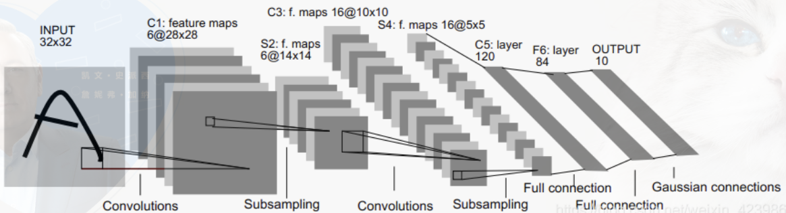

# Artificial Intelligence 人工智能

参考: [Berkeley AI课程](https://inst.eecs.berkeley.edu/~cs188/fa18/)

- 定义：
  - perceives its environment and take actions that maximize its chance of success at some goal
- Four definitions of AI
  - acting humanly、thinking humanly、acting rationally、thinking rationally

## Ch01 Search

### Uniformed Search

- planning agents

- A search problem consists of:

  - A state space
  - A successor function(with action and costs)
  - A start state and a goal test

-  State Space search tree && Graphs

- Tree Search: Which fringe nodes to explore

  - BFS(Breadth-First Search)广度优先搜索

    - Fringe is a FIFO queue(the lowest-depth node)
    - the swallowest solution be s, so
    - Time Complexity：$O(b^s)$
    - Space Complexity: $O(b^s)$
    - Compelte: 完备
    - Optimal：只有cost=1时完备

  - DFS(Depth-First Search)深度优先搜索

    - Fringe is a LIFO stack
    - m层深，b-branching factor, Time Complexity:$O(b^m)$, Space Complexity: $O(bm)$
    - 非完备（Compelte，m could be finite）
    - 非最优（Optimal）
    - SO-> be avoided for search trees with large or infinite maximum depths

  - 融合： DFS的空间优势+BFS的时间优势

    ```cpp
    DFS(depth limit)->no solution： BFS
    ```

  - UCS(Uniformed-Cost Search)

    - Fringe is a priority queue（the cheepest node），可以看作based on BFS
    - Time Complexity: $O(b^{C^*/L})$
    - Complete: 完备
    - Optimal： yes(eg: A*)

### Informed Search

- Heuristic启发式算法：当前到目标点的距离
- Greedy Search
  - 选择最近的节点orz
  - Worst： badly-guided DFS
  - Best：  直达
- A* Search
  - 结合 UCS && Greedy，前者依据path cost：g(x)，后者依据goal proximity：h(x)
  - A* f(x)=h(x)+g(x)，即Distance from A + Heuristic distance
  - 停止条件： dequeue a goal! 出队列
  - Optimal? need admissible Heuristics:h(x)。  
  - 最优条件：h(s)所估计的s点到终点的距离，一定要小于等于实际中s点到终点的距离
  - 改进A*
    - ARA* - Anytime Repairing A*：松散限制条件->次优解，再慢慢收紧条件，so必有解
    - D* - Dynamic A*：环境未知/可动态变换，目标点反向至起始点在openlist
    - Field D*：加入插值
    - Block A*：对block操作
- Graph Search
  - A* optimals if heuristic is consistent
  - UCS optimal（h=0 is consistent）
  - 对比tree search: A* is optimal if heuristic is admissible, UCS is a special case (h = 0)
- 其余
  - dijkstra
  - Bellman-ford：时间复杂度过高，但恒optimal, 强化学习常用？
  - RRT：Rapidly-exploring Random Tree，complete but no optimal

### Adversarial Search

- 对抗搜索，muti-agent
- zero-sum games, 如：吃豆人，chess，checkers
- Minimax Search，己方max对方min ->choose action
  - state-space search tree
  - players alternate turns
  - 像DFS，Time Complexity:$O(b^m)$, Space Complexity: $O(bm)$
- Alpha-Beta Pruning  [参考](https://www.7forz.com/3211/)
  - $α$: prune min states
  - β： prune max states
- Maximum Expected Utility 算法


## Ch02 Constraint Satisfaction Problems

- CSP:约束满足问题

  - 如数独，八皇后,涂色问题

- 回溯搜索Backtracking Search

  - DFS+ varible-ordering + fail-on-violation

- Improving

  - filtering,减少搜索空间

    - 前向检查: forward checking

    - 约束传播：Constraint propagation

  - Ordering

    - MRV启发式： minimum remaining values,选选择余地最少的节点
    - LCV策略：最小约束，对其他人影响最小，选色时尽可能将尚未使用的颜色留给后面，先用已经用过的颜色

  - Structure：cutset conditioning

- Min-conflicts算法

  - Interative min-conflict常用

## Ch03 Machine Learning

- 应用： Binary Classification，Playing Go
- Supervised vs Reinforcement
  - Supervised： learning from teacher
  - Reinforcement： learning from critics
- Data Problem： incorrect，missing
- Binary Perceptron -> Muticlass Perceptron
- 1.标准网络

  - 感知器 Perception
  - 前馈网络：FeedForward NN ->最简单，感知器的集合
    - Input layers、Hidden layers、Output layers
    - 基于反向传递迭代参数

  - FeedBack NN 反馈神经网络 :Boltzmann机
  - ResNet 残差网络
    - 前馈深度过高梯度消失
- 2.循环网络

  - RNN：Recurrent Neural Network 循环神经网络
    - 包含循环并在自身递归，考虑数据关联，但循环易带来梯度爆炸或消失
    - 多使用tanh作为激活函数
  - LSTM：Long Short-Term Memory  长短期记忆神经网络
    - 时间序列，与RNN相比多出输入控制、输出控制、忘记控制，解决梯度消失问题
  - ESN 回声状态网络 Echo State Networks
    - 递归变体，把中间的层变为随机连接的存储池，学习的过程就是学习存储池的连接
- 3.卷积网络

  - CNN：卷积神经网络，多层前馈
    - Input layers->Convolution Layers->Hidden Layers->Output Layers
    - 卷积层和池化层：降低图像维数
    - Hidden Layers 压缩图像信息
    - LeNet-5 7层->卷积+池化*2 卷积+全连接 输出
      - 卷积:Convolution 卷（翻转g）积（对应点相乘累加），可以看作一种滤波算子（如高斯、均值滤波），在这里起特征提取作用。边缘需填充(Padding 0)，
      - 池化：Pooling 也称下采样或欠采样，常用Max Pooling或Average Pooling，前者保留纹理特征后者模糊化处理保留图片背景。池化层作用是压缩数据，降低维数
      - 全连接层Full connection：Flatten层将特征图拉伸成一维向量，再输入全连接层。作用是依据之前提取的特征进行分类。
      - 输出Sofmax分类
    - AlexNet
    - VGG:小卷积核时代
    - GoogleNet:深，但Inception结构的引入未扩大参数量（每一层转变为多个卷积分支，每个分支分别处理最后拼接）
  - DNN: 反卷积神经网络：Deconvnet
    - 与卷积相反，不是减小维数，而是创造图像
  - GAN：Generative Adverarial Network对抗生成网络
    - 生成器+判别器，前者反卷积生成图像，后者卷积负责鉴定生成图像真假，动态博弈
    - DCGAN，CycleGan，BigGAN等，风格迁移，人脸替换
    - CycleGan：两判别器两生成器
- 4.自动编码器
  - 自动编码器 AE
    - 将原始高维数据压缩为低维，并投影到新的空间
    - 常用于降维，图像压缩，数据去噪，特征提取等，可有监督可无监督
  - 可变自动编码器 VAE 
- DNN： Deep Neural Networks 深度神经网络

  - 自学习特性，无需传统方法进行特征选择等问题
- 方法
  - 交叉验证 Cross-Validation
  - 反向传递 Back Propagation 从后向前进行参数的更新
- 优化器
  - 梯度下降法 gradient descent：最陡峭的地方下山
    - 缺点：a.学习率小->收敛慢，大->极值点震荡，b.陷入局部最小
    - ->SGD:Stochastic Gradient Descent
    - full batch/mini batch/stochastic(online):accurate or faster
      - 批梯度下降：慢、全局最优，小批量梯度下降折中，随机梯度下降：快、局部
  - Momentum: 基于SGD，防止波动，加滤波->平均值作为当次w
  - Adagrad：变学习率，逐渐衰减->缺点最后变得非常小
  - RMSprop：对梯度大的方向减小其学习率，梯度小的地方增加其学习率
  - Adam（Adaptive Moment Estimation）：Momentum 和 RMSprop的结合
    - 计算每个参数自适应学习率，缺点：后期梯度较小变慢
  - 综上：小数据量SGD，其余可以无脑Adam
- 评价
  - 分类问题
    - 0-1损失函数
    - 交叉熵损失函数
    - hinge损失函数：
      - 分类正确损失0，错误损失$1-yF(x)$。
      - 即便对了对置信度不高的也会有惩罚，eg：SVM
    - 分类评估指标
      - 准确率 Accuracy Rate
      - 召回率 Recall 预测正样本中预测正确的比例
      - 查准率 Precision 正样本中预测正确的比例
      - F1 Score：召回率和查准率的调和平均
      - ROC图(伪阳性-真阳性)，AUC图
  - 回归问题
    - MAE:Mean Absolute Error 平均绝对误差：L1损失，不多用->即便小损失也是大梯度
    - MSE:Mean Square Error   均方误差：L2损失，二次
    - Huber Loss              结合MAE与MSE，小损失二次，大损失一次
- 激活函数 Activate Function 非线性能力->若无非线性激活函数，输出只是输入特征的线性组合(有点像非线性系统了，一个非线性元件->系统)
  - Sigmoid ：
    - 01映射，二分类
    - 缺点：指数运算慢，软饱和性->两侧梯度消失，偏移现象->输出恒大于0，下一层输入必>0
  - tanh：
    - 收敛快于sigmod，无偏移问题(关于0对称 有归一化作用)，但同样具有软饱和问题
  - ReLU
    - 大于0为x，小于0为0
    - 计算快、>0不存在饱和问题->减少梯度消失问题
    - x<0时神经元死亡，偏移现象->输出均值>0
    - relu在零点不可导->人为赋0
  - Leaky ReLU/ P-ReLU
    - 小于0时仍然有值，避免梯度为0不动
  - Softmax 多分类问题
- 过拟合问题 overfitting： 少数据、深模型、过度训练等等

  - 增加数据 Data Augmentation/ 数据清洗 data cleaning
  - 添加噪声
  - 数据均衡化
  - 正则化
    - L1,L2正则化： 在目标函数加入参数的L1/L2范数，使参数尽可能小，降低模型复杂度
      - L1拉普拉斯先验，得到稀疏解；L2高斯先验，得到平滑解
    - Dropout层： 随机丢弃（care：dropout+BN可能1+1<2）
    - BN批量正则化：Batch Normolization，每个隐含层进行归一化，将每一层拉到标准分布，减小梯度消失
      - BN多归一到[-1,1]，倾向于0对称，且若用[0,1],relu失去意义
        - BN是对批样本同一维度特征做归一化，多用于图像；LN是对单个样本所有维度做归一化，多用于文本
  - Bagging && Boosting，多弱模型组合>单个强模型
  - 及时止损 early stopping
- 样本不平衡

  - 欠采样 undersampling：去除多的样本，使得数据量级相近，改进：丢弃非核心样本，或将多的分成N个集合训练N个弱模型->集成
  - 过采样 oversampling：扩充少的样本，如SMOTE算法（人工构建数据集，加入噪声）
  - 合适的评价指标
  - 代价敏感：对错分施加额外惩罚
- 预处理

  - 特征归一化 Normalization：提升收敛速度，提高模型精度，防止梯度爆炸
    - min-max normalization，Z-score Normalization
    - 树形结构不用归一化->寻找最优分裂点，阶跃不可导，无法用梯度下降求解

  - 标准化 standardization
  - 数据去噪/增强
  - 降维
    - PCA Linear      无监督
    - LDA Linear      监督
    - LLA non Linear  无监督
    - Laplacian non Linear  无监督
- Error = Bias + Variance + Noise

  - Error整个模型的准确度，Bias模型准确率，打靶准但不稳，Variance模型稳定性，打靶稳但瞄不准
- 梯度爆炸与梯度消失（返向优化BP角度）

  - 激活函数导数大于1，深层网络->链式法则->爆炸
  - ​          接近0，               ->消失(relu一定程度上有利于削减梯度消失)
  - tricks
    - 梯度截断->设上限
    - 权重正则化，将网络权重参数加入loss->若爆炸loss极大
- Softmax多分类：输出(0,1)，选取概率最大的概率
- Markov Decision Process
  - 马尔科夫决策问题：MDP->强化学习
  - each MDP state projects an expectimax-like search tree
  - Bellman贝尔曼方程：当前状态的价值 = 到达当前状态的价值 + 下一状态的价值
  - Sovle
    - dynamic programming methods 动态规划法
    - Monte Carlo methods 蒙特卡洛法
    - temporal difference 时间查分法
- DQN：Dyna-Q Learning
  - behavior policy
  - target policy

- 目标检测
  - 传统算法
    - 基于特征+分类，如滑动窗口+HOG+SVM+NMS
      - hog：图像归一化预处理->计算梯度->梯度直方图->Block滑动重叠
  - 机器学习
    - Two-Stage：CNN: Faster R-CNN(Region with CNN)等
    - 基于回归(one-shot) Yolo，SSD等
      - Yolo：You Only Look Once
        - end-to-end一个网络即可，一个特点：快
      - SSD(Single Shot Multibox Detector)

