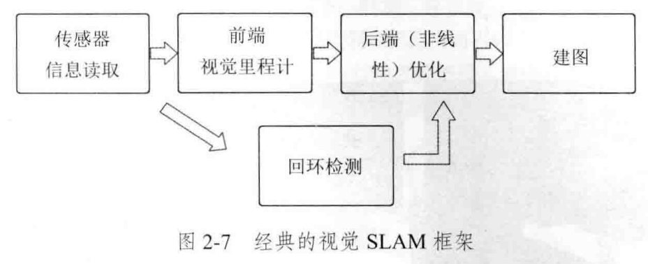

- 嵌入式系统（Embedded System）：软件硬件可裁剪、成本低、体积小、功耗低、可靠性高、实时性
  - 单片机：Single Chip Microcomputer   Soc(System on Chip)  
  - MPU(Micro-processers) 微处理器
  - MCU(Micro-Controller Unit) 微控制器
- Real-time operating system
  - Rt-thread:三个版本：标准、Nano、smart
  - Nano：内存占用小，功能包括任务处理、软件定时器、信号量、邮箱和实时调度等特性
    - 多线程任务调度，256优先级，调度器进行线程切换，优先级抢占机制
    - 同优先级，time-slice时间片不同，按 时间片轮转机制 调度
    - 调度锁，上锁后调度器停止工作，不进行线程切换，但仍可响应中断；可嵌套，上锁和解锁尽可能同一线程
    - 信号量，用作同步或互斥，有限资源的使用数量控制；多线程
      - 应用：任务同步如中断中，用时不能太长，利用信号量翻转； 任务互斥，如两种状态
    - 互斥量，保护共享资源
      - 相比于信息量：使用不当不会造成优先级翻转问题(使用优先级继承算法)
        - 优先级翻转，高优先级等低优先级的信号量，但此时中优先级执行->优先级翻转
        - 优先级继承：临时提高低优先级的优先级
      - 加锁解锁在同一个线程内，互斥量只能0-1
    - 事件Event，事件是信号量的扩展，事件告知，类flag
    - 邮箱mb：固定容纳四字节
    - 消息队列mq：邮箱的扩展，异步通讯，先进先出
  - 优化等级 -O0 O1 O2 O3 Os，推荐O2

- ARM Cortex-M3/M4
  - 32bit，哈佛结构，三级指令流水线(取指 译码 执行)
  - Thumb-2指令集
- GPIO: push button， ratary encoder switch， LEDs， buzzer
- 常见通信接口
  - IIC: Inter-Integrated Circuit 内部内置集成电路总线 
    - 半双工 同步 串行 
    - 两信号线：串行数据线SDA与时钟线SCL，信号需上拉
      - 起始信号：SCL高，SDA高到低，停止信号：SCL高，SDA低到高,都是主机发送
      - 应答信号：应答位NACK/非应答位NACK，接收端发送
    - 优点：简单，占空间少，多主控
  - UART: Universal Asynchronous Receiver Transmitter通用异步收发器
    - 低速 全双工 异步 串行
    - 双线RX TX通信
    - 缺点：低速，结构复杂
  - SPI： Serial Peripheral Interface 全双工同步主从式通信 串行外设接口
    - 高速 全双工 同步 串行
    - 三信号线：SCLK（串行时钟）、SDI（串行数据输入）、SDO（串行数据输出），加从机选择线CS
    - 一主机多从机 ，可GPIO软件模拟IIC
    - 缺点：无应答机子
- 传感器
  - 摄像头
    - CMOS: OV7725 MT9V034等
    - 线性CCD
    - 果冻效应：物体运动速度与快门扫描速率 量级接近 ->提高卷帘快门的扫描速度，but此时曝光度会降
  - 电磁：LC(并联)谐振电路
  - 霍尔传感器，光敏
  - IMU： 陀螺仪、加速度计、磁力计
    - MMA7260
  - 编码器：光学/霍尔原理居多
    - 旋转式(增量式与绝对式) && 直线式
    - 增量式：正交编码/解码，AB相位相差90°
    - 测速方法：M法(适合高速)、T法(适合低速)、M/T法(可测转速范围宽，精度高)
- 人机交互HMI
  - 按键：常规机械按键 数码开关 拨码开关
    - 经典机械按键防抖方案：一般按下50-100ms，抖动10ms左右
      - 硬件防抖：并联电容，电容充放电->低通滤波
      - 延时防抖：变化->等10ms->再读取
      - 中断延时：连续多次中断读取一致
    - 旋转编码开关防抖：正交解码，上升/下降沿触发->二次确认
  - LED灯
  - 显示屏->触摸屏
- 通信
  - 串口
    - 通信协议的定义：起始位 | 数据位 | 校验位 | 停止位
      - 校验位：常用奇偶校验，循环冗余校验(CRC)等
    - 波特率：单位时间传输的位数，单位bps(bit/s)，波特率因子K
    - 环形队列接受：节省空间，首尾指针
    - 数据传输方向：单工 Simplex，半双工 Half duplex，全双工 Duplex，单向、对讲机、电话
    - 异步与同步：
      - 关键区别：是否使用共同的时钟和同步信号
      - 异步：各自时钟，一帧以字符为单位，传输效率低，简单
      - 同步：同一时钟，以数据块为单位，传输效率高，速度快
  - SD卡
  - 蓝牙
  - Flash
- 控制对象
  - 舵机
    - 组成：电机、传动齿轮系、驱动控制、反馈电位器
    - 0.5ms-2.5ms， GND VCC PWM
  - 电机
    - 机械特性曲线 转矩与电流正比，反电动势与转速正比
    - H桥驱动
- ADC
- PWM
  - 等宽PWM，正弦PWM(SPWM),电流跟踪型PWM，磁链追踪型PWM
  - SPWM：冲量/面积等效，等幅不等宽的矩形脉冲序列
    - 载波：高频等腰三角形，调制波：期望正弦波
- Semihost Mode
- RTC芯片时钟 Real Time Clock：掉电正常运行，可校准
- 系统中断
  - 轮询方式和中断方式
  - FTM: FlexTimer Module 多用于硬件中断
  - PIT：Programmable Interval Timer
  - Systick中断:延时
- 车辆控制
  - 车辆模型：
    - 经典阿克曼转向模型
    - 自行车模型：阿克曼简化为两轮

  - 运动规划 Motion Planning
    - Pure Pursuit：基于预瞄
    - Stanley：基于横向偏差与航向偏差
    - 曲线拟合：贝塞尔曲线、B样条曲线、多项式曲线
- MPC控制
  - Model predictive control，本质是求解开环最优问题
  - 预测模型、反馈矫正、滚动优化、参考轨迹
- 

### 检测技术

- 检测 = 测量 + 被测对象有用信息的信号检出
- 检测误差
  - 系统误差：可再现，可理论分析消除或减少
  - 随机误差：不确定因素，概率统计处理，无法消除
  - 粗大误差：异常或故障，尽可能剔除
- 检测精度
  - 正确性：测量结果接近真值的程度，反应系统误差大小，打靶准
  - 精确度：测量结果的分散程度，反应随机误差大小，如打靶散
  - 准确度：与真值的一致程度，以上两者均有反映

- 特性：
  - 重复度：最基本的指标
  - 分辨力：能被检出的最小变化量，分辨率=分辨力/量程
  - 灵敏度：$k = dy/dx$，与分辨率呈反比
  - 线性度：实测曲线偏离理想直线的程度
  - 稳定性与零漂，回程误差，死区，响应时间，测量时间等等

- 传感器：
  - 位移式传感器：电感式->差动、光栅式、电容式
  - 测距传感器：电涡流、激光测距、超声测距
  - 角度测量：圆光栅、光电式
  - 温度测量：热电偶、热电阻、半导体热敏电阻、辐射温度计、颜色温度计、亮度温度计
  - 力/压力测量：电阻应变式、压阻式
  - 速度传感器：多普勒测速器
  - 加速度传感器：压电式、应变式
  - 流量传感器：差压式、流阻式、振动式、测速式、质量流量式等
  - 电磁量传感器：光纤式、霍尔磁量测量

### 电力电子技术

- 定义：使用电力电子器件对电能进行变换与控制的技术
- 电力电子器件
  - 特点：处理功率、需控制、需驱动电路、总是处于开关模式
  - 功率损耗：通态损耗、开关损耗（开通损耗与关断损耗）、断态损耗
- 功率器件
  - 不控器件：功率二极管(与常规二极管相比：耐大电流、高电压、电导调制效应)
    - 根据反向恢复时间：整流二极管(General type diodes)、快恢复二极管、肖特基二极管(Schottky Diodes)
    - 大电流：垂直导电+大体积->更多pn结，高电压：低掺杂
  - 半控器件：晶闸管（可控开不可控关）
    - 导通条件：正向电压+门极触发电流；维持导通：大于维持电流；关断条件：通过电流降到接近0(可施加反向电压或外电路)
  - 全控器件：BJT GTO MOSFET IGBT
    - 双极性晶体管BJT(GTR):
    - 门极可关断晶闸管GTO
    - MOSFET
    - IGBT 
- 电力电子变换电路  DC/AC-DC/AC Converter
  - 交流->直流：整流 Rectifier
  - 直流->交流：逆变 Inverter
  - 直流->直流：斩波 Chopper
  - 交流->交流：交流调压、变频 DC Chopper
- DC-DC Converters（Chopper）
  - 非隔离型
    - Buck变换器
    - Boost变换器
    - Buck-Boost变换器：相当于Buck串联Boost
    - Cuk变换器
  - 隔离型
    - 正激Forward：隔离型Buck
    - 反激Flyback：隔离Buck-Boost
- DC-AC Converter（Inverter）
  - SPWM正弦脉冲调制
    - 原理：面积/冲量等效原理(Area/impulse equivalent Principle)：冲量相等而形状不同作用于同一惯性环节->响应基本相同
    - 单极性/双极性调制 Unipolar/Bipolar Modulation
    - 同步调制 or 异步调制，前者载波比为常数，后者不是

- AC-DC Converter（Rectifiers）：Diode or Thyristor Rectifiers
- AC-AC Converter 交交变频

### 机器人学

- 定义
  - re-programmable, multifunctional. They can assist or even replace humans in completing dangerous, heavy and complex work.
  - 感知：actuator 传感器：sensors  控制系统：control system
  - Three Laws of Robotics
- 链式结构：连杆 Link 0 - 关节Joint 1 - link 2
- 自由度：Degrees of Freedom (DoF)
  - Dof = 关节数，6Dof最常见，3 4 5 7也有
- 关节
  - 平移关节 Translational or Linear
  - 旋转关节 Rotational
- 坐标系
  - 笛卡尔(直角)坐标：PPP，工作空间：方形，简单，
    - 优点：简单，缺点：空间利用率低，Can only reach in font of itself
  - 圆柱形坐标：RPP,工作区间：柱
    - 优点：can reach all around itself，缺点：仍无法到达高于自己的
  - 球形坐标：PRP,工作区间：橘子皮
  - 仿人型坐标：RRR，缺点：计算较难。titan
  - SCARA：RRP
- 运动学
  - 正运动学：关节变量->末端执行器位姿
    - D-H表示法：坐标系确认

  - 逆运动学：末端执行器位姿->关节变量
    - 解存在与否?
    - 闭环解(解析解)：只适用于简单的构型
      - 代数法
      - 几何法

    - 数值解：迭代方法
      - SD(Steepest descent)最速下降法，GN(Gauss-Newton)法，LM方法
      - 优点：适用性广，缺点：精度自定义，只能返回一组解

  - 雅可比矩阵 Jacobian
    - 关节速度->末端执行器速度，关节力矩->末端执行器力
    - $\dot{\vec{x}}=J(\vec{\theta}) \dot{\vec{\theta}} \quad \Rightarrow \quad \delta \vec{x}=J(\vec{\theta}) \delta \vec{\theta}$
- 动力学

  - 拉格朗日方程

### SLAM

参考：高翔博士《视觉SLAM十四讲》

- 同步定位与地图构建: Simultaneous Localization and Mapping 
  - 搭载视觉或激光雷达的机器人，在没有环境先验信息的情况下，在运动中建立环境信息并估计自己运动的过程
  - 感知、定位与建图、规划与控制
  - 基本问题：针对状态方程+观测方程->状态估计问题(如何通过带噪声的测量数据 估计状态变量)求解
    - 后验sfM问题 -> 贝叶斯公式：似然(Prior)*先验(Likelihood)
    - 状态最优估计，使得后验概率最大(MAP问题)->最大化似然问题(MLE问题，Maximize Likelihood Estimation)，在什么状态下最可能产生现在观测到的数据 
    - 噪声：线性/非线性、高斯/非高斯
    - 滤波器方案:增量方法，基于马尔可夫假设
      - 卡尔曼滤波(Kalman Filter)：基本只能解Linear Gaussian(线性高斯系统)
      - 扩展卡尔曼滤波(ekf),线性化误差和噪声高斯分布假设
      - 粒子滤波(Particle Filter)
    - 优化方法：批量运算，较优
      - 非线性优化方法
      - 图优化(Graph Optimization)
- 传感器
  - 绝对感知：GPS、UWB等，场景局限
  - 碰撞传感器：扫地机器人、昆虫机器人
  - 超声波传感器：舵机加一自由度，伪激光雷达，局限：分辨率低($15°$扫描角度太大，较小物体->大)，可基于概率模型融合建图
  - 毫米波雷达 Millimeter-wave lidar：依据多普勒效应测速
  - 激光雷达
    - 原理：测距+扫描
      - 测距原理
        - 三角法：发射器->物体反射->感光位置不一样，用的最多（扫地机器人）,角度不均匀
        - dTof:直接测量时间->光速*时间。测量精度高、功耗低，但光速太快，测量速度要求高->iTof
        - iTof：间接测量相位差->距离，低频的脉冲信号。测量精度降低(波长变长、精度降低) ->可多次测量：多脉冲逐步细化，so单个发射器，多个接收器一直接收，代价距离近
      - 扫描原理：机械扫描（最常用）、MEMS、光学相控阵、阵列成像(AR)
    - 采样频率：角分辨率=360/点数
    - 如：Velodyne、Sick TIM、SLAMTEC等
  - 相机
    - 单目（monocular）、双目（stereo）、RGB-D，此外还有全景相机、Event相机等
    - 单目：尺度不确定性（Scale Ambiguity）：小孔模型问题
    - 双目：基线已知(Baseline)
    - RGB-D:增加Tof测距或红外测距，如Kinect (v2)
    - 针孔相机模型：
      - 相机内参K，张正友棋盘标定法，
      - 相机外参R t，相机坐标系到世界坐标系
      - 畸变：
        - 径向畸变：桶形畸变和枕形畸变，越靠近边缘越明显
        - 切向畸变：成像面与镜头不平行
- 经典SLAM框架
  - 
  - 前端视觉里程计(Visual Odometry, VO):估算相邻两帧的运动
  - 后端优化(Optimization):接受前端位姿与回环检测信息并进行优化,主要任务是从带有噪声的数据中估计整个系统的状态（非线性优化与滤波）
  - 回环检测(Loop Closure Detection):解决累计漂移问题(Accumulating Drift)
  - 建图(Mapping)
    - 度量地图 Metric Map：稀疏(Sparse),稠密(Dense)
    - 拓扑地图 Topological Map：图
- 坐标系变换（刚体变换,欧式变换）$T$
  - 变换矩阵表示法：$\mathrm{SE}(3)=\left\{\boldsymbol{T}=\left[\begin{array}{cc}
    \boldsymbol{R} & \boldsymbol{t} \\
    \mathbf{0}^{\mathrm{T}} & 1
    \end{array}\right] \in \mathbb{R}^{4 \times 4} \mid \boldsymbol{R} \in \mathrm{SO}(3), \boldsymbol{t} \in \mathbb{R}^{3}\right\}$
  - 旋转数学表示
    - 旋转矩阵表示法：R
      - 正交矩阵，$R^T=R^{-1}$，正交群表示为：$\operatorname{SO}(n)=\left\{\boldsymbol{R} \in \mathbb{R}^{n \times n} \mid \boldsymbol{R} \boldsymbol{R}^{\mathrm{T}}=\boldsymbol{I}, \operatorname{det}(\boldsymbol{R})=1\right\}$
    - 旋转向量表示法：旋转轴 $n$+旋转角 $\theta$，紧凑但奇异
      - 旋转向量->旋转矩阵:罗德里格斯公式
      - 旋转矩阵->旋转向量：$tr(R)=1+2cos\theta$
      - $Rn = n$ 
    - 欧拉角表示法
      - 绕x：横滚角 Roll，绕y：俯仰角 Pitch，绕z：偏转角 Yaw
      - 万向锁：俯仰角$±90^°$,损失一个自由度（三次旋转变两次），紧凑但奇异（没有不带奇异性的三位向量描述）
    - 四元数表示法 Quaternion
      - 复数：一实部三虚部，可与角轴互化
      - 四个量描述三维旋转，紧凑且无奇异
  - 欧式变换、相似变换、仿射变换、射影变换
- 李群和李代数
  - 群Group：一种集合+一种运算。
    - 运算满足：封闭性、结合律、幺元、逆

  - 李群：具有连续(光滑)性质的群，一种李群对应一种李代数:SO(3)->so(3)、SE(3)->se(3)
  - 李代数：由一个集合、一个数域、一个二元运算（李括号）组成，描述李群的局部性质。
    - 封闭性、双线性、自方性、雅可比等价

- 非线性优化
  - 对非线性最小二乘问题，解析解难解，使用数值解法。将这一问题在初始值附近线性化->线性最小二乘问题->迭代求解
  - 寻找导函数为0->寻找下降增量，直到增量为接近0
  - 最速迭代法（牛顿法）：一阶过于贪婪，二阶Hession难计算
  - Gauss-Newton：目标函数fx，一阶泰勒展开，相当于用$JJ^T$替代牛顿法的Hessian
  - LM方法：泰勒展开只能在展开点附近起作用，因而可以增加一个信赖区间（常取球），仅在此范围内认为增量有效。
  - 非凸问题->初值敏感、局部最优问题
- 动态场景
  - 点云配准基于静态假设，动态点比例高精度下降
  - 动态物体漂移鬼影
  - 静态物体、半静态物体(如可开的门)、动态物体
- 自动驾驶等级

  - SAE自动化等级Lv0-Lv5
  - 无自动化、辅助驾驶、部分自动化、| 有条件自动化、高度自动化、| 完全自动化
- 路径规划

  - Global 全局 && Local  局部
  - 离线 && 在线
  - Complete and Optimality
