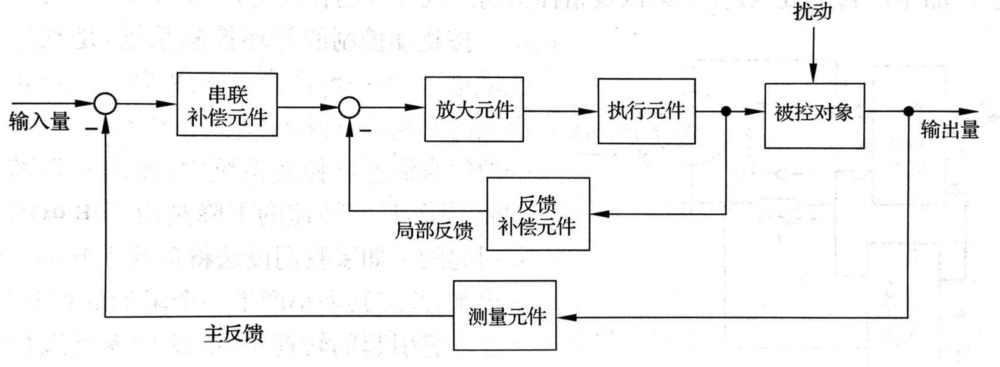
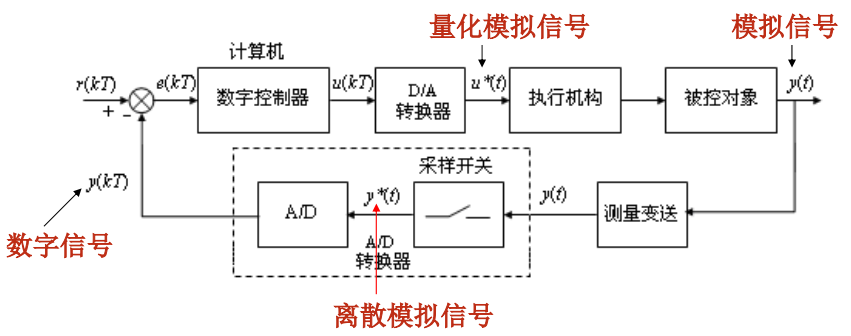
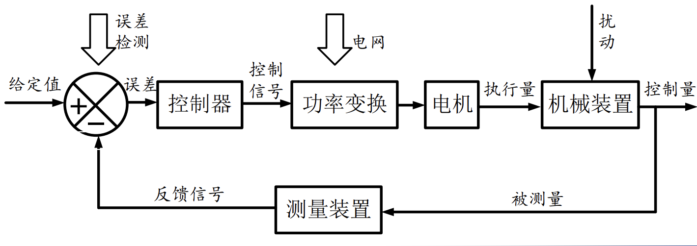

# 控制

## 自控

The first three industrial revolutions came about as a result of mechanisation, electricity and IT. Now, the introduction of the Internet of Things and Services into the manufacturing environment is ushering in a fourth industrial revolution.

### 控制概述

- 系统：一些相互制约的部分所构成的整体

- 控制系统：

  - 自动控制概念：无人干预，使用控制器，使被控对象或被控量，按预定规律运行
  - 历史：
    - 离心调速器-李雅普诺夫稳定性-PID-反馈-系统->第二代控制理论(太空竞赛)现代控制理论 ->计算机控制理论-智能控制理论-模糊、自适应、神经网络
    - 经典控制理论：离心调速器--李雅普诺夫稳定性--PID--反馈--系统
      - 线性控制理论：时域、频域、复域分析
      - 非线性控制理论：相平面法、描述函数法、李雅普诺夫法、波波夫法
      - 离散控制理论
    - 现代控制理论：状态空间分析-最优控制
    - 大系统理论：多
    - 智能控制理论：模糊控制等

- **反馈(闭环)控制理论**

  - 反馈：取出输出端送回输入端，并与输入信号相比较产生偏差信号
  - 负反馈：输入减反馈，使偏差变小；反之称正反馈
  - 基本组成
  - 测量元件 : 检测被控量，若非电量则转电量 
  - 比较元件 ：比较反馈值与输入值得到偏差, 如差动放大器、机械差动装置、电桥电路等
  - 给定元件 ：给定输入量
  - 放大元件 ：将比较元件给出的偏差信号放大
  - 执行元件 ：作用于被控对象，如阀、电动机等
  - 矫正元件 ：又称补偿元件，结构或参数便于调节，以串联或反馈方式改善系统性能

- **基本控制方式**

  - 闭环(反馈)控制 && 开环  

    - 开环: 单方向传递、 结构简单成本低、控制效果差扰动敏感
    - 闭环：存在反馈回路、结构复杂成本高、控制效果好精度高、参数不当可能震荡甚至发散

    - 按扰动控制(顺馈控制)：补偿可测扰动、抗扰较好、精度较高、较反馈控制简单、只能补充一种扰动

  - 复合控制：偏差控制+扰动补偿

- 基本要求/目标 ：稳 准 快

  - **稳定性**：系统正常工作的先决条件
    - 被控量偏离期望值的初始偏差应随时间增长逐渐减小并趋近于0
      - 稳定的恒值控制系统——被控量因扰动偏离后恢复设定值
      - 稳定的随动控制系统——被控量始终跟随输入量的变化

    - 线性系统的稳定性与外界因素无关，只由系统结构和参数决定
    - 过渡过程——常呈振荡形式，稳定系统的振荡过程逐渐减弱达到平衡，不稳定系统振荡逐渐增强直到失控。*(平衡：小于传感器测量精度或者设定？没有绝对的平衡)*
  - **快速性**：动态性能要求
  - **准确性**：控制精度的重要标志
    - 稳态误差要求：平衡状态下，被控量达到的稳态值与期望值之间的误差

- 分类

  - **线性定常系统**：可用线性微分方程描述
  - 连续与离散
    - 连续系统：模拟信号
    - 离散系统：脉冲信号(脉冲开关)或数字信号(采样开关)
  - 线性与非线性
    - 线性：满足叠加性与齐次性
    - 非线性：含有非线性元件，暂无通用方法

### 控制模型

- 建模方法
  - 机理建模 && 实验辨识
- 数学模型
  - 静态数学模型：描述变量之间关系的**代数**方程
  - 动态数学模型：描述变量各阶导数之间关系的**微分**方程
- 常用数学模型
  - 时域：微分方程、差分方程、状态方程
  - 复数域：传递函数、结构图
  - 频域：频率特性
- 典型输入信号
  - (单位)阶跃函数、斜坡函数、加速度函数、脉冲函数、正弦函数
- 结构图 && 信号流图
  - 信号流图：结构简单，只适用线性系统
  - 图->传递函数：Mason 或 化简
- 分析方法
  - 时域分析法
  - 根轨迹法
  - 频域分析法
- **1.时域分析**
  - 线性元件微分方程：求解：经典法、拉氏变换法，解=特解+通解
  - 线性系统的基本特性：满足**叠加定理**->可加性(+)与齐次性(*)
  - 非线性系统->线性化：
    - 简化模型：忽略
    - 切线法：小范围做泰勒去高次幂——平衡情况偏离，小偏差情况下，合理
  - 评估指标：
    - 动态指标：上升时间(10% to 90%)、峰值时间、调节时间(2% or 5%)、超调量
    - 稳态指标：稳态误差
  - 单位阶跃响应、单位脉冲响应、单位斜坡响应
- **2.复数域模型-传递函数**
  - 定义：零初始状态下，系统输出量的拉氏变换与输入量的拉氏变换之比
    - 零初始状态：系统输入输出量及其各阶导数都为0
      - 输入为0：t>0时输入才作用于系统
      - 输出为0：系统处于稳定的平衡状态
  - 性质：输入-输出映射、只取决于系统结构与参数，与输入无关、复数域研究
  - **零点和极点**
    -  可实数可复数，符号：零点-○，极点-×，研究：零极点分布图
    -  极点就是微分方程的特征根，决定系统稳定性，决定了系统模态(e^(λt))
    -  零点影响各模态在响应中所占的比例
  - **典型环节**：比例 积分 微分 一阶 二阶 纯滞后
  - 系统物理可实现：分母阶次>=分子阶次
- **3.根轨迹**
  - 开环系统的某一参数从0变到无穷时，闭环系统特征方程式的根在s平面上变化的轨迹
  - 闭环零点 = 前向通道开环零点 + 反馈通道开环极点
  - 180°根轨迹 && 0°根轨迹（非最小相位系统）
  - 广义根轨迹
    - 参数根轨迹：变化增益不在开环增益位置->等效
    - 多参数根轨迹：定一画一，定k2=0变k1，再定k1变k2（恰以k2=0的线为起点）
  - 零极点对根轨迹
    - 增加极/零点，根轨迹向s左/右半平面弯曲，稳定性变好/差
    - 移动极/零点，极/零点右移，稳定性变差/好
- 频域分析法
  - 频率特性定义：线性系统，在正弦信号作用下，其稳态输出与输入**幅值比、相角差**对频率的关系
  - 幅频特性 && 相频特性
  - 特性图
    - Nyquist图(幅相特性曲线)
    - Bode图(对数频率特性)：展宽低频，同时也能表示高频
    - Nichols图(对数幅相特性)
  - 指标：增益裕度$GM$、相位裕度$\gamma$、增益剪切频率$w_c$、相位穿越频率$w_g$
  - 三频段理论
    - 低频段：反应稳态误差(开环增益K与系统型号v)，目标：陡高->稳态精度高
    - 中频段：反应动态性能(相位裕度$\gamma$、增益剪切频率$w_c$)，目标：缓宽
      - 增益剪切频率$w_c$高->系统快速性好，中频段缓(-20)宽(覆盖广)->稳定性好
    - 高频段：抗高频干扰能力，目标：陡低(衰减快->抗干扰)
- 最小相位系统：系统开环传递函数 在右半s平面不具有极点与零点，且不具有纯时滞因子
  - 区分：频域中，w趋于无穷时，是否满足(n-m)*(-90°)
  - 非最小相位系统：纯时滞、负响应、开环不稳定

### 系统稳定性

- 一个系统稳定是指系统在平衡状态下，收到外部扰动而偏离平衡状态，当扰动消失后，经过一段时间的调整，系统能回到原来的平衡状态

- 稳定性
  - 外部稳定性-BIBO稳定性(有界输入有界输出)->经典控制理论中的稳定性
    - 判据：传递函数阵所有极点都有负实部
  - 内部稳定性->现代控制Lyapunov稳定理论
    - 李雅普诺夫渐进稳定性->工程意义下的稳定性，严格(要求最终回到$x_e$)
    - 判据
      - 李雅普诺夫第二法
        - 广义能量函数$V(x)$正定，$\dot{V(x)}$负定(辅助判据：$\dot{V(x)}$半负定且不恒为0)
        - 核心：能量函数的构造：雅可比矩阵法与变量梯度法
        - 对线性定常连续系统，特殊判据：给定正定阵Q是否存在唯一正定对称阵P
  - 内部稳定必外部稳定，理解：内部不稳定子状态可能不可观，或者说子空间内不稳定极点可能被消去未表出
- 判别方案
  - 线性系统：Rough、根轨迹、李雅普诺夫
  - 非线性：李雅普诺夫(通用方法)
  - 对非线性系统多个平衡状态，描述稳定性，相对于某平衡状态稳不稳定

- 频域判据
  - Nyquist判据
    - 映射：幅角定理(柯西定理)
    - Z=P+N, 右半s平面闭环极点个数=右半s平面开环极点个数+G平面上曲线包含(-1,j0)点的圈数，Z=0稳定
  - Bode判据
    - Z=2N+P，Z=0，稳定
  - 三频段理论
    - 穿过0db的斜率：-20dB/dec 稳定，-40不一定，-60必不稳定
    - 控制器的设计目标：
- 

### 控制器设计

- 形式
  - 位置式：易产生积分饱和，适合执行机构无积分特性
  - 增量式
- 校正方式：串联校正、并联校正、复合校正
  - 串联校正
    - 超前(PD):改善动态性能
    - 滞后(PI):改善稳态性能
    - 超前滞后(PID)：同时改善

  - 根轨迹校正与Bode图校正
- PID控制器
  - Proportional、Integral、Derivative
  - 偏差控制，无模型算法
  - 作用
    - Kp：有差调节，调节速度快
      - 静态性能：kp↑，稳态误差↓，控制精度↑
      - 动态性能：kp↑，响应加快，kp过大震荡次数多不稳定
    - Ki：无差条件
      - 静态性能：Ki↑，消除静差
      - 动态性能：Ki↑，积分作用加强，过大会产生超调与积分饱和现象
    - Kd：有稳态余差(D不单独使用->存在死区，如e很大但不变)
      - Kd↑，有利于改善动态性能，响应加快，超调减小，but降低抗高频干扰能力
- 改进
  - 积分饱和
    - 积分分离法：大偏差取消积分
    - 有效偏差法：
    - 遇限消弱积分法：设置积分上限
  - 微分高频扰动->串接低通滤波
    - 不完全微分：接在PID输出后或单独微分项输出
    - 微分先行：输出微分先行(编码器环节)、偏差微分先行(偏差环节，或者说pid输入)
  - 带死区PID
- PID参数整定
  - 理论设计法（做题家) 给时域指标->根轨迹或时域参数法，给频域指标->Bode图
  - 工程镇定法
    - 经验试凑法
    - 临界比例度法(稳定边界法)：选择控制度(数字控制器相对模拟控制器的效果)
      - 纯P调节比例度直到等幅震荡，记录临界比例度和临界震荡周期->查表
      - Shannon采样定理： 采样周期的上限，成本决定了下限
    - 衰减比例度法：纯P调节比例度，直至两次波衰减比为4:1->记录比例度与周期->查表
    - Ziegler-Nichols整定法：阶跃响应->曲线最大斜率处作切线，交x轴，分段->$\alpha,\tau,K$->查表填写
- PID特点
  - 优点：响应快，不依赖模型，可补偿误差，应用广泛，鲁棒性强
  - 缺点：无法补偿时滞(大时滞会导致系统稳定性变差，甚至产生震荡)
- 内膜控制器 IMC
  - 对模型纯滞后进行近似(如一阶Pade近似)->分解可逆与不可逆->IMC理想控制器->加低通滤波->控制器
  - 可实现抗干扰控制或设定值跟踪控制，依赖准确模型
  - 性质
    - 对偶稳定性：若模型准确，则IMC内部稳定的充要条件是：过程与控制器都稳定
    - 理想控制器特性：模型准确且$1/G_p(s)$存在且实现，则输出对输入无偏差跟踪，且抗干扰
    - 零稳态偏差特性：由于IMC本身存在积分作用，不存在稳态误差
- Smith预估控制：解决大时滞
  - 核心：反馈等效模型纯滞后之前的信息，或者加补偿器反馈使之不含时滞项
  - 有效解决纯滞后问题，但依赖准确的模型参数，且扰动造成的干扰仍然存在
  - 工程化改进
    - 使扰动传递函数=0->Smith完全抗干扰改进
    - 增益自适应Smith预估补偿控制
    - Smith-PID
- 常见控制器设计思想
  - 串级控制：
    - 扰动影响输入，干扰在环，闭环控制
    - 双闭环，双控制器串联；副回路响应需快于主回路(主副环频率f相差3-10倍)；调节阀由副回路控制
    - 整定方法：断开主回路整定副回路，直至获得快响应->工程整定法整定主回路
    - 主控制器(用PI或PID)：保证被控量符合要求，要求无误差；副控制器(用P或PI)：消除副回路二次扰动，快速性，不要求无误差
    - 副环：高频率大增益，保证大干扰在副环内被抑制，加快调节速度改善延迟
    - 相比于直接加一个反馈回路(测量+蒸汽阀)来说，并未增加蒸汽阀，经济
  - 前馈控制：
    - 扰动影响输出，干扰可测，开环控制
    - 可用条件：扰动可测但不可控，扰动变化频繁且变化大，扰动带来较大影响
    - 优点：调节及时；缺点：存在残差(so多与PI控制器一起使用->前馈-反馈系统)
    - 引入前馈，系统特征方程不变，系统稳定性不变。
    - 前馈-反馈控制系统：前馈用于抑制扰动，反馈用于弥补前馈无法消除的扰动和不可测干扰带来的误差。
  - 比值控制：
    - 用于物料混合领域，保证两种物料的流量保持一定比例
    - 选择可能供应不足的作为主流量(主流量可测不可控，副流量可控)
  - 选择控制(超驰控制、取代控制、保护控制)
    - 多控制器、可切换选择、用于设备软保护(如超安全限制、切备用)
    - LS 低选，HS 高选
  - 分程控制：多入单出
    - 一个控制器的输出带动多个执行器，每一执行器仅在输出信号某段工作
  - 均匀控制：控制量与被控量缓慢地在一定范围内变化
  - 推断控制：测辅助变量
- 模糊控制 Fuzzy Control
  - 合理的规则即可，制定规则占用精力
- MPC控制器 Model Predictive Control
  - 数据驱动，基于对象模型但不完全依赖模型
  - 利用过程中的简化动态模型预测未来状态，选择"最优"控制策略，并利用实测输出来反馈校正模型预测
  - 核心：预测模型、滚动优化、反馈校正
  - 特点
    - 优点：a.建模方便，不涉及机理  b.预示作用->类似前馈  c.MIMO同样适应(相比之下，无法解耦的PID表现不好)  d.适合处理约束  e.滚动优化->动态效果
    - 缺点：a.计算量大->适合慢过程  b.需闭环特性分析  c.非线性对象需额外计算量
  - 如：动态矩阵控制DMC，模型算法控制MAC，广义预测控制GPC等
  - 带稳态目标优化的MPC，加入松弛变量，按优先级逐步放松约束，最后对总体进行优化
- 动态矩阵控制 DMC Dynamic Matrix Control
  - 基于对象阶跃响应的MPC,适用于渐进稳定的线性系统，增量式算法
  - 参数选择
    - 采样周期T：上限(Shannon),下限(运算量)，T太大有利于稳定不利于克服扰动，T太小跟踪效果好但计算量大
    - 建模时域N:20-50
    - 优化时域长度P：P大稳定性好，P小快速性好
    - 控制时域M，M大快速性好，但稳定性下降
    - 控制权重矩阵R、误差校正向量h(抗扰性和鲁棒性)

  - 改进：MIMO-DMC：全局整体优化，前馈DMC：某干扰已知->前馈补偿，DMC-PID串级控制，有约束DMC(启发式求解->牺牲部分局部最优性)
- 模型算法控制MAC：基于系统脉冲响应

### 非线性系统

- 线性 or 非线性
  - 最大区别：非线性不满足叠加定理
  - 非线性稳定性与初始条件、输入信号有关
  - 非线性存在极限环(持续震荡)
    - 极限环指，无外界激励时，固定振幅及周期的震荡，且不易受参数的影响(与线性系统的临界稳定性相反)
- 非线性特性：死区、饱和、间隙、继电器特性
- 分析方法
  - 对非本质非线性系统：小扰动-线性化
  - 本质非线性系统：只能非线性方法
    - 相平面法：多用于二阶
    - 描述函数法：不完善
    - 波波夫法
    - 微分几何法
    - 李雅普诺夫法：第一法：平衡点近似->局部稳定性，第二法->能量角度但函数难构造
- 描述函数法
  - 描述函数N(A)是非线性环节的基波分量与正弦输入信号两者的复数比
  - 线性系统频率法在非线性系统的推广，假设线性和非线性环节可分离，仅考虑基波分量(大多数线性元件具有低通特性)，又名谐波线性化方法
  - 优点：简单，适用于高阶和各类非线性
  - 缺点：理论不完善(结果既不充分也不必要)，丧失部分非线性信息
  - 结构图化简：非线性并联->描述函数之和，串联->不是乘积
  - 稳定性分析：结构图等效->画-1/N(A),G(jw)，不包围：稳定，包围：不稳定，临界：可能自振(穿出是)

- 相平面法
  - 针对一阶二阶非线性
  - 奇点：斜率不确定点，多条相轨迹汇入或流出
    - 中心点/鞍点，稳定的焦点/不稳定的焦点，稳定的节点/不稳定的节点
  - 对非本质非线性系统，先奇点线性化再作图
  - 作图：等倾线法/奇点分析
  - 相平面内求响应时间：积分法、增量法、圆弧法、

### 现代控制理论

- 经典控制 vs 现代控制
  - 传递函数(黑匣子) vs 状态空间
- 一些概念
  - 状态变量：足以**完全表征**系统运动状态的**最少个数**的一组变量
    - 状态变量之间相互独立、状态空间的选取不唯一、实际状态变量个数=独立储能元件个数

  - 状态空间表达式=状态方程+输出方程
    - 建立：方框图、机理建模、传递函数/高阶微分方程
    - 状态方程：由系统的状态变量构成的描述系统动态过程的一阶微分方程组
    - 状态方程：状态矩阵A,输入矩阵B，输出矩阵C，直接传输矩阵D
    - 状态矩阵A的特征值->极点
- 状态响应=零输入输出响应+零输出响应
  - 零输入响应：输入信号为0时系统由初始条件引起的响应
- 能控性与能观性
  - 能控性判据
    - 定义法：状态转移角度
    - Cram矩阵判据：Cram矩阵非奇异
    - 矩阵秩判据：rank(M)=n，且detM可表示为能控度
    - PBH秩判据，对所有特征值都有...
    - PBH特征向量判据
    - 约旦标准型判据

  - 能控能观对偶系统理论：AB互为对偶系统，则A的能控性等价于B的能观性
  - 定理：在任意非奇异线性变换下，线性定常系统能控性与能观性不变->标准Ⅰ型
  - 能控/观性结构分解
- 最小实现 Realization：既能控又能观的实现，不可简约的实现
- 状态/输出反馈
  - 输出矩阵维数<状态矩阵维数(损失信息)
  - 状态矩阵可利用信息量大，可更自由支配系统响应，但状态反馈部分不可观->状态观测器
  - 影响：状态反馈：不改变能控性，可改变能观性；输出反馈：不改变能控能观性
- 极点配置问题：通过反馈，配置极点到指定位置
  - 可配置极点的充要条件：系统完全能控
  - SISO:能控标准型法与比较系数法
  - MIMO:建议西尔维斯特法
  - 镇定问题：通过反馈，使系统稳定
    - 可镇定的条件：系统不能控子系统是渐进稳定的(状态反馈只能改变能控子系统的极点)
- 状态观测器
  - 全维状态观测器
  - 降维状态观测器： 能观系统的输出y已包含部分状态信息
- 最优控制问题：LQR控制器

### 计算机控制系统

- Computer Control System概念
  - 由计算机参与并作为核心环节的自动控制系统
  - 即应用计算机参与控制并借助一些辅助部件与被控对象相联系，以获得一定控制目的而构成的系统，其中控制器功能由计算机实时完成
  - 特点：
    - 结构混合：控制器离散，被控对象连续(->决定离散化与连续化两种设计方法)
    - 信号混合：包括模拟、离散模拟、数字信号
    - 实时数据采集->实时控制决策->实时控制输出
- 性能指标
  - 稳定性：当扰动作用消失后，系统恢复原平衡状态的能力。
    - 判定：闭环系统极点(特征根)的位置：极点位于s平面左半平面(连续系统)，或z平面单位圆内(离散系统)
    - 判据：
      - Rough：z平面双线性变换(w变换)->w域内rough
      - Jury： 只能判断系统稳定性，不能判断不稳定极点个数
  - 稳态指标：稳态误差（当系统过渡过程结束后，系统参考输入和输出之间的偏差）->位置、速度、加速度误差系数
    - 稳态误差与采样周期T的关系：被控对象中包含与其类型相同的积分环节(如I型系统包含一阶积分)->有关，否则无关
  - 动态指标(超调量，调节时间，峰值时间，震荡次数等)
  - 综合指标(如积分性能指标)
- 结构组成
  - 数字控制器、D/A转换器、执行机构和被控对象、测量变送、采样开关、A/D转换器 
  - 

- 信号变换
  - 信号类型
    - 模拟信号：时间上连续、幅值上连续(连续信号)
    - 离散模拟信号：时间上离散、幅值上连续(采样信号)
    - 数字信号：时间上离散、幅值上量化
    - 模拟信号 采样->离散模拟信号 A/D转换->数字信号 D/A转换->模拟信号
  - 采样 using采样开关
    - 每隔T，开关短暂闭合，对模拟信号进行采样，得到时间上离散数值序列
  - A/D转换： 输入模拟量数字化(离散模拟信号->数字信号)
    - 直接转换器：
      - 逐次逼近型(天平称物、对分搜索)：but抗干扰能力不够
      - 并联比较型：
    - 间接转换器：
      - 单积分型
      - 双积分型(电容充放电、计数器)：but速度不够快
    - 误差来源：转换精度、转换速率
  - D/A转换： 滤波思想->保持器
    - D/A转换包括解码与信号保持两步，数字信号 解码->离散模拟信号 信号保持器->连续信号
    - 误差：解码器精度、保持器形式、时间间隔T
    - 保持器
      - 零阶保持器：a.低通特性，但不理想 b.相位滞后T/2特性 c.简单
      - 一阶保持器：a.幅频特性比零阶高 b.低频相移小，但整体相移大，对稳定性不利 c.较复杂
- 香农采样定律(Nyquist采样定理):不失真恢复模拟信号的采样频率，应大于模拟信号频谱中最高频率的2倍 $w_s>=2w_{max}$
  - 频域混叠：采样信号各频谱分量互相交叠
    - 连续信号频谱无限带宽，频域混叠恒发生
    - ..........有限带宽，$w_s<2w_{max}$则频域混叠
  - 工程上，快过程常取$w_s=10*w_c$，慢过程查表
- Z变换
  - z变换方法：级数求和法、部分分式法、留数计算法
  - z反变换：长除法、部分分式法、留数法
  - 扩展z变换
- 脉冲传递函数 求解：差分方程、传递函数模型、单位脉冲响应
- 数字控制器设计
  - 离散化设计方法：核心：把整个系统离散化
    - 根轨迹设计法、频率响应设计法、解析设计法(最小拍控制、大林控制)
    - 最小拍控制器：时间最优，不管其它因素
      - 时间最优控制、稳定、采样点上不存在稳态误差
      - 定义：是时间最优控制，即闭环系统在最少的采样周期内达到稳定，且系统在采样点上的输出能准确跟踪输入信号，不存在稳态误差
      - 缺点：a.采样点之间可能存在纹波 b.各典型输入函数的适应性差(输入函数变结果差) c.对被控对象的模型参数变换敏感
      - 工程化改进(一一对应)
        - a.无纹波设计
        - b.阻尼因子法：在闭环传函中引入附加的极点因子，调节时间换稳定性：不再是最小拍->适应性好
        - c.有限拍：提高$z^{-1}$的幂次，增加自由度，降低敏感度
    - 大林算法：重超调，不care时间
      - 可以理解为Smith预估器对于一/二阶+纯滞后的特例
      - 问题
        - 振铃现象：控制器输出以1/2采样频率大幅衰减的振荡
          - 此时控制量y正常，但会带来执行机构磨损，有可能影响稳定性
          - 区分纹波现象：y有问题
        - 分数时滞：时滞不是采样周期的整数倍
  - 模拟化设计方法：简单，但只用于采样周期比较小的情况(因为相当于忽略了零阶保持器和采样开关->T/2的延时)
    - z变换法：简单、D(s)稳定则D(z)必稳定、产生频率混叠(高频干扰->可提高采样频率)
    - 差分变换法：矩形近似
      - 后向差分法：D(s)稳定则D(z)必稳定、D(z)频率畸变、产生频率混叠
      - 前向差分法：D(s)稳定则D(z)不一定稳定、D(z)频率畸变较大，so一般不用
    - 双线性变换法：梯形近似：不存在频率混叠、D(s)稳定则D(z)必稳定、频率低频近似高频严重畸变
    - 零极点匹配法：具有双线性变换特性，适合零极点形式出现的对象
- 微机系统
  - 基本要求：操作性能好、方便、维修方便、通用性好便于扩充、可靠性高
  - 特点:功能可分配(云、边、端)，系统可集成设计，可测试性设计，可维修性设计
- 分布式计算机控制系统 DCS
  - 原则(核心)：功能分散、管理集中
  - 结构形式：多级分层、合作自治，标准化、系统化、模块化
  - 四层体系结构
    - 综合管理层：管理信息系统MIS
    - 集中监控级：面向工程师、提供界面
    - 分散控制级：数据交互、控制调节(如PLC调节器)
    - 现场设备级：感知与执行(如传感器变送器)
  - 网络基础：串行数据传输(平衡/不平衡模型)，接口标准：RS232,RS422,RS485
  - 缺点：a.一对一 b.可靠性差 c.控制集中在控制站  d.兼容性差   ->so 现场总线控制系统FCS
- 工业网络化控制系统:具有开放统一的通信协议
  - 特点：开放、互操作性、环境适应性
  - 三层体系结构：信息层、控制层、现场设备层
  - 现场总线：串行、数字式、双向传输、多分支结构
  - 全开放、全数字化、全分散、互操作
  - 现场总线控制系统FCS =  现场总线 + 现场设备、
    - 与DCS相比：FCS一对N(DCS一对一)，FCS全开放(DCS封闭专用)，FCS分散功能块(DCS全分散式)
    - 典型现场总线：CAN FF LonWorks

### 过程控制系统

- Process Control
  - 以表征生产过程的参量为被控量，使之接近给定值或保持在给定范围的自动控制系统
  - (过程：存在能量或物质的相互作用与转换)
  - 指化工、冶金、石油等工业部门，以连续性物流为主要特征
  - 被控对象：工业设备，被控变量：温度、压力、流量、液位、成分与物性
  - 特点：a.被控对象多样性 b.对象存在时滞和非线性  c.控制方案多样化  d.有多个过程检测仪表
  - 目标：安全、经济、稳定
  - 控制算法：PID MPC Robust 最优控制 解耦控制
- 非最小相位系统：纯时滞、负响应、开环不稳定
  - 大时滞：Smith预估器
  - 负响应设计：可将负响应系统近似为时延系统、或使用负响应补偿
  - 开环不稳定(至少有一个右半平面极点)：两步法设计PID
- 系统辨识
  - 数据驱动型
  - 最小二乘法：最小化误差性能指标
    - 加权最小二乘法(不同误差权重)，递推最小二乘法(基于以前估计加入修正量进行递推修正)，指数遗忘型最小二乘法(加入遗忘因子，以近期观测数据为主，适合慢时变系统)
  - 基于阶跃响应的辨识
    - 图解法
    - 时域辨识 Time Domain Approach
    - 频域辨识 Frequency Domain Approach
- 模型种类
  - 集总：与空间无关，常微分方程
  - 分布：与空间有关，偏微分方程
- 守恒：能量守恒，物料守恒，摩尔守恒，热能守恒

- Runge-Kutta法
  - 求解非线性常微分方程，后一个离散点的斜率由前几段斜率线性组成
  - 优点：快，不需计算高阶导数，精度较高
  - Eular法->二阶特例

- 多入多出 MIMO
  - 稳定性：经典：传递函数矩阵所有极点都位于左半平面，状态空间：矩阵A所有特征值都有负实部
  - 辨识：独立单回路辨识，分散继电器辨识，开环阶跃测试辨识(叠加原理)
  - 耦合与解耦
    - 耦合：控制变量之间是相互影响的，一个控制变量改变会引起几个被控变量变换
    - 解耦：消除系统之间的相互耦合，使各系统成为独立的、互不相关的控制回路
    - 耦合测度$\lambda$
    - 相对增益矩阵序列： Relative Gain Array
    - 附加规则：NI指数(Niederlinski指数)，当NI<0，系统必不稳定
    - 完全解耦($\lambda>>1$)：前馈补偿法、对角矩阵法、单位矩阵法
  - 分散控制
    - RGA失调因子法：部分解耦，根据解耦效果配对
    - 独立设计法、修正ZN法、基于等价传递函数(ETF)、最优化方法等

- 性能评估与监控
  - 极限测试
  - 性能参数计算方程：稳态质量平衡、能量守恒、质量平衡的闭合百分差
  - 斯华特控制图
  - s控制子图
  - 统计过程控制SPC

### 运动控制系统

参考教材《运动控制系统》，阮毅、陈维钧主编， 清华大学出版社

- 运动控制系统 Motion Control System
  - 也称电力拖动控制系统 Control Systems of Electric Drive
  - 特点：快，被控对象：位置、速度、加速度(力矩/力)等
  - 以电机与负载为控制对象的自动控制系统
  - 

- 运动控制系统分类
  - 按电机种类：直流/交流电机
    - 直流：控制简单，成本高，发热->效率低，可靠性差->维护成本高
    - 交流：控制复杂，成本低，可高速运行或大功率运转，无需过多维护
  - 按被控量：调速/位置随动(又称伺服系统)
    - 调速：控转速，着重抗扰性；随动：控位置/角度，着重跟随性
  - 按控制器类型：数字/模拟
  - 按闭环数：单环/双环/多环

- 直流电机
  - 定子+转子，前者做机械支撑并产生磁场，后者感应电势实现能量变换
  - 调速
    - 恒转矩调速(适合重载)
      - 调压调速：较大范围无极调速(用最多)
      - 调阻调速：有级调速
    - 恒功率调速(适合轻载)
      - 调磁调速：无极，但调速范围小，只能在弱磁条件下使用
  - 相控整流-电动机系统
  - 直流PWM变换器-电动机系统:四象限工作，可逆调速系统
  - 开环调速(特性太软)→闭环调速(启动堵转、电流过大)→电流截止负反馈(系统有静差)→PI控制系统(启动波形不够理想)→双闭环系统
    - 闭环机械特性硬，静差率小，代价是必须增设电压放大器和检测与反馈装置
    - 闭环系统静特性由无数条开环机械特性构成
    - 单闭环无法同时控制转速与电流两个变量->转速电流双闭环
    - 转速外环(主环，用PI)，电流内环(副环)
  - ASR 转速调节器，ACR 电流调节器，APR 位置调节环，TG 测速发电机，TA 电流互感器，UPE电力电子变换器

- 伺服系统

  - 定义
    - 使输出量快速而准确地跟踪和复现给定量的变化，又称随动控制系统
    - 输入：位置给定量，被控量：线位移与角位移
  - 特点: 精度高、稳定性好、动态响应快、抗干扰能力强、工作频率宽
  - 分类方式
    - 按控制原理：开环、半闭环、闭环
      - 开环：精度不高，取决于机械传动与伺服驱动的精度，简单便宜方便，动态性能差。如步进电机就是开环(无反馈)
      - 半闭环：并非直接测量实际位置
      - 闭环:存在精准测量的反馈回路，控制精度高、参数不当不稳定
      - 稳定性：开环>半闭环>闭环，精度：闭环>半闭环>开环
    - 按执行元件(按能量变化元件)：电磁式、液压式、气动式、其它
  - 跟随性能
    - 检测误差：线性度、灵敏限(死区)、分辨率、重复性、迟滞误差、温度误差、稳定性
    - 系统误差：给定误差与扰动误差
      - 前者与开环增益和前向通道中所有的积分环节总数相关，后者只与扰动点之前的开环增益和积分环节个数有关
      - 对位置控制系统，I型用纯P，Ⅱ型用PI或PID
    - 抑制稳态误差：增大开环增益或扰动点前前向通道增益，在系统前向通道设置积分环节
  - 三环伺服系统(内环到外环设计)
    - 单环位置：PD/PID，需加电流截止负反馈保护(防止冲击电流太大)
    - 双环(+电流闭环)：电流闭环抑制启动制动电流，同时加快电流响应过程，使用PID
    - 三环(+转速闭环)：使用P

- 特殊的伺服系统

  - 步进电机
    - 基本原理：脉冲信号->线位移或角位移
    - 工作原理：定子通电方式，单相/双相/单双相，轮流通电，错齿是使步进电机旋转的根本原因
    - 变脉冲顺序变转动方向，变脉冲频率控电机转速
    - 相数m，拍数n，步距角，步距角精度
    - 特性：力矩随转速上升而下降，起步速度一般较低
    - 驱动:整步、半步、细分
  - 舵机
    - 位置/角度伺服
    - 控制方式
      - PWM: pulse width modulation 
      - PPM: pulse proportional modulation
        - 多通道，可单线传输多信号，最大整合8个通道(理解为整合PWM)
      - PCM: pulse code modulation

- 交流电机

  - 定子中通入交流电，生成的磁动势是一个旋转的磁动势
  - 分类：异步和同步
    - 同步：转差率=0，转子转速与定子电流频率有严格比例关系
    - 异步：定子电流能量->转子机械能+转差功率
      - 工作的必要条件：转子转速小于同步转速
      - 调速分类：转差功率消耗型、转差功率回馈型、转差功率不变型(最常用其中的 变压变频调速)

  
