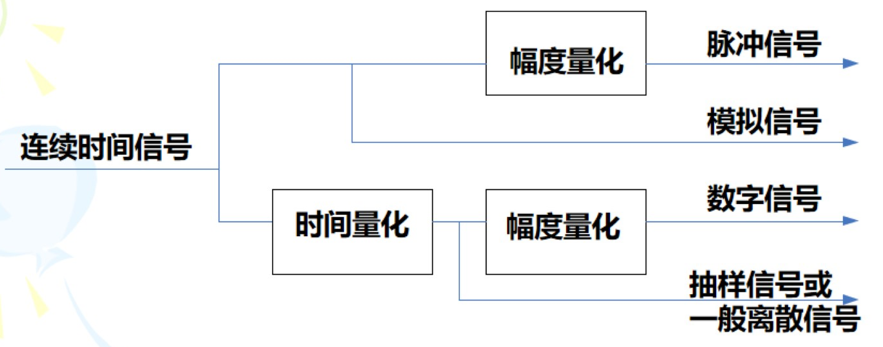

### 信号与系统

胡光锐《信号与系列》 上海交通大学出版社

- 信号：试图传递某种信息的物理现象
- 系统：一些相互制约的部分所构成的整体
- 信号分类
  - 周期/非周期
  - 连续/离散
  - 
  - 连续函数表示：指数信号、正弦信号、副指数信号、抽样信号、奇异信号(单位阶跃、单位冲激、冲激偶函数)
  - 离散函数表示：单位阶跃序列、单位样值序列、矩形序列、实指数序列、正弦序列、复指数序列
  - 时域 频域 与复频域： 信号可分解为 冲激信号/不同频率正弦信号/不同频率复指数信号 的线性组合
- 系统描述
  - 因果性 Causality：系统在任意时刻的输出都只与当前输入和这一时刻以前的输入有关
    - 非因果系统物理不可实现
  - 稳定性 Stability: 有界输入有界输出BIBO(Bounded Input, Bounded Output)
  - 时不变性 Time-invariance 输入时移，输出产生同样时移，除此之外无任何变化。
  - 线性 Linearity：满足叠加定理（可加齐次）
- 卷积运算：反转，平移，叠加，求和
- 周期信号的傅里叶级数表示：将周期信号用一组成谐波关系的复指数信号或正余弦信号的线性组合。

