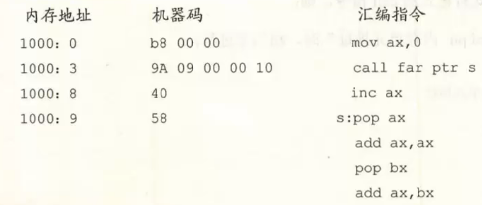

# 8086记录

## 绪论

- x86

- why8086是16位机
  - 运算器一次最多处理16位数据
  - 寄存器的最大宽度16位
  - 寄存器与运算器之间的通路16位

- 应运而生的汇编

  - 机器语言：不同cpu有不同指令集

  - 汇编语言：汇编本身仍然是机器语言，不过是加了助记符

  - 高级语言：eg：c、python等

- 汇编语言

  - 汇编指令（核心）机器码的助记符
  - 伪指令   编译器执行，计算机不执行，无对应机器码
  - 其它符号 +-等，编译器识别，无对应机器码

- CPU 内存

  - CPU由： 控制器、运算器、寄存器组成
  - CPU与内存间交互：三种总线
  - 交互太频繁，so寄存器内置cpu，暂存作用
  - 存：指令 && 数据
  - 存储单元：每个存储单元一个字节（8bit），即八位二进制数，1KB = 1024B，1MB = 1024KB等

- 总线

  - 地址总线：存储单元的地址，决定cpu寻址能力
  - 控制总线：读或写       ，决定cpu与其它元件进行数据传送时一次数据传送量
  - 数据总线：数据         ，决定cpu对系统中其它器件的控制能力

- CPU
  - 运算器
  - 控制器
  - 寄存器（主要）
    - 通用寄存器： AX BX CX DX 存放一般性数据，可分AH AL等，8086寄存器都是16位的
      - 
      - 操作对象一致性：-

- 物理地址 （20位）= 段地址 （16位）+ 偏移地址（16位）

  - 合成方法 = 段地址 * 16（左移四位） + 偏移地址

  - 123C8 = 1230->12300 + 00C8

  - 一个段长度： $2^{16}$（偏移长度）

  - CS:IP指向的内容为当前执行的指令，代码段寄存器：CS， 偏移地址什么都能装，IP对应指令指针寄存器

    	

- JMP指令
  - 

- MOV指令

  ```cpp
  eg1.
      MOV BX,1000H
      MOV DS,BX     //care： DS不能跟立即数放在一起，MOV DS，1000H 
      MOV AX,[0]    //将DS:0 即1000:0处的字形传入AX
      MOV [0],CX    //CX中的16位数据传入DS:0 即1000:0
      
  eg2： MOV不能修改CS段内容  如mov [0],CS 错
        段寄存器不能加[], [ax] [bx] [dx] [ds] 错
  eg3： MOV AX, [BX] //等价于：(AX) = ((DS)*16 + (BX))
        MOV [BX], AX // 上面反过来
        MOV ax, [bx]+200 = [bx+200] = [bx].200 //将偏移地址(bx)+200送入ax
  ```

- PUSH POP

  SS:SP指向栈顶元素

  ```cpp
  PUSH AX  //寄存器AX中的数据放入栈 
           //实际两步：sp = sp - 2； ax中内容放入ss:sp指向的内存单元
  POP AX   //栈顶的数据取出放入AX
      
  eg1. MOV AX,1000H
       MOV DS,AX //将段地址放入DS 
       PUSH [0]  //将1000:0处压入栈
       POP [2]   //出栈，将数据送入1000:2
  eg2  堆栈操作是16位的
  ```

  

- 源程序文件： ->可执行文件（二进制）

  ```cpp
  assume cs:×××           // 将CS指向×××代码段
      ××× segment         //从此处编写×××段 
          mov ax,0123H    
          mov bx,0456H
      
          mov ax,4c00H    //此两行示意代码段结束
          int 21H
      ××× ends            //×××段结束
  end
  ```

- (AX) 表示AX当中的内容，(21000H)表示21000H处的内容

- LOOP指令

   - 两步： (CX)=(CX)-1, 判断（CX）是否0->跳转标记或继续

   - ```cpp
         MOV CX,11
     s:  ADD AX,AX
         LOOP s
     ```

   - 

     ```ruby
     ## 循环求数之和
     assume cs:codesg
     codesg segment
         dw 0123H,0456H,0789H
     start:
     	mov bx, 0
     	mov ax, 0
     	
     	mov cx, 3   ## 循环三次
     s:  add ax, cx:[bx]
         add bx, 2
         loop s
         
         mov ax, 4c00H
         int 21H
     codesg ends
     
     end start
     ```

   - 

   

- inc:自增

- 栈

   ```ruby
   ```

- 与运算 AND，按位操作

   或运算 OR， 按位操作

   异或   X0R

   ```cpp
   AND AL, 10111111B //将AL第六位清零
   OR  AL, 01000000B //将第六位置1
   XOR BX,BX   //清零
   ```

- 字符串  mov al,'b'

- Call指令    ret与call操作相反 

   ```cpp
   eg1: 相当于 push IP + jmp near ptr 符号 
        如下图： call s相当于 将当前IP(下一条指令对应的偏移地址)：6放入栈中，然后跳转到s: pop ax,
                故完整执行完后输出 AX = 6
   补： CALL AX 相当于跳转到偏移地址AX的地方
   ```

   

   ```CPP
   eg2: 相当于 push cs + push ip + jmp far ptr 符号 
       如下图: cs(1000)入栈  IP(3)入栈  跳转s:AX = 9,  AX=ax+ax = 18   BX = 1000  AX = 1018
   ```

   

   

- 模块化编程  函数 using call && ret

   - 

- 寻址方式

   - 直接寻址       [0]  [寄存器]
   - 寄存器间接寻址  [bx]
   - 寄存器相对寻址  [bx+100]
   - 基址变址寻址    [bx+sd]
   - 相对基址变址寻址 [bx+si+200]

- 转移指令·
  - 段内转移与段间转移	
    - 前者只修改IP，如jmp ax
    - 后者同时修改CS:IP, 如 jmp 1000:0
  - 分类
    - 无条件跳转
    - 条件跳转
    - 循环指令
    - 过程
    - 中断

- 寄存器

   ```cpp
   AX:  函数返回值，加法乘法等
   BX   辅助寻址等
   CX   loop循环计数
   DX   辅助AX，进行乘除法
   SI、DI 寻址
   BP    基址指针，8086不常用
   SP    栈顶指针
   CS、IP  搭配段地址与偏移地址
   DS    数据段段地址
   ES    扩展段段地址
   SS    栈段
   FLAG  标志寄存器
   ```

   

- 标志寄存器 

   - 作用
      - 用于存储相关指令的执行结果
      - 为cpu相关指令提供依据、
      - 控制cpu相关的工作方式
   - 16位， OF DF IF TF SF ZF AF PF CF
   - ZF  零标志位，记录执行操作后其结果是否为0， 是ZF=1
   - PF  奇偶标志位，二进制所有bit位中1的个数是否为偶数，偶数个1则PF=1
   - SF  符号标志位，记录执行相关指令后结果是否为负数，负数则SF=1
      - 不管有符号数还是无符号数，只是一种记录，取决于运算后第一位
   - CF  进位标志位，假想最高位， 减法借位也算
   - OF  溢出标志位
   - DF  definition flag，控制每次si与di的增减
      - cld： DF标志位清0
      - std： DF标志位置1
   - MOV指令一般不改变标志位

- 条件转移指令

   - JE    等于则转移，如JE s
   - JNE   不等于则转移
   - JB    低于则转移
   - JNB   不低于则转移
   - JA    高于则转移
   - JNA   不高于则转移

- ADC指令   adc A,B  相当于： A=A+B+CF

- SBB指令   sbb A,B  相当于： A=A-B-CF

- CMP指令   CMP A,B  相当于A-B，但不保存结果，只对flag寄存器进行重置

   - 例如： cmp ax，ax  flag变为： zf=1，pf=1，sf=0，cf=0，of=0
   - 故可以用cmp指令比较数大小等等，用途广泛

- 串操作指令： movsb、movsw指令，配合rep使用

   - movsb	     

      ```cpp
      相当于： ((es)*16+(di))=((ds)*16+si)   数据段si偏移地址中的内容放入扩展段
              之后，若df=0，inc si，inc di
          		 若df=1，dec si，dec di  (sb的b相当于byte，所以偏移量为1)
      ```

   - movsw

      - sw中w是word，所以自增自减偏移2

   - 示例如下图，cld作用：df=0，若用movsw则用std

- 

- pushf指令：将标志寄存器的值压入栈中

  popf指令： 出栈，放入标志寄存器 

- 中断

  - 内中断

    - 除法错误，如溢出->0
    - 单步执行->1
    - into指令->4
    - int指令->int n，中断码n

  - 中断类型码(一个字节->可表示256种中断信息)

  - 中断向量表：存储中断处理程序入口的列表，存储着256个中断源对应的入口

    - 对8086,0000:0000到0000:03FF的1024单元存放中断向量表，一个表两个字节，高字节段地址，低字节偏移地址

  - 中断过程：中断类型码->中断向量表->修改CS:IP->中断处理程序

    ```cpp
    取得中断处理码N-> pushf -> TF=0,IF=0 -> push CS -> push IP -> (IP)=(n*4),(CS)=(n *4+2)->中断处理程序
    
        保存寄存器（栈）-> 处理中断 -> 恢复寄存器 -> 用iret指令返回
    ```

    

  - int指令 int n，n为中断类型码

  - BIOS/DOS   rom中存放一套程序，称为BIOS，用于处理硬件检查、初始化，系统中断等相关

    ​		   dos也会提供一些中断例程 

-  cpu可读取： cpu内部的寄存器，内存单元，端口

  - 定位64KB端口，只能用in和out指令读取和写入，只能使用AX与AL访问(一个读取八位端口一个读取16位端口)

- CMOS RAM,包含实时钟和一个有128个存储单元的RAM存储器，关机后实时钟仍然工作，ram信息不丢失

- SHL与SHR

  - shl逻辑左移，最后移出的一位移出到CF中，最低位用0补充
    - 移动多位，必须将立即数写在cl当中，如shl al，cl
  - shr逻辑右移，移出的位写入CF，最高位用0补充， shr al，1 
