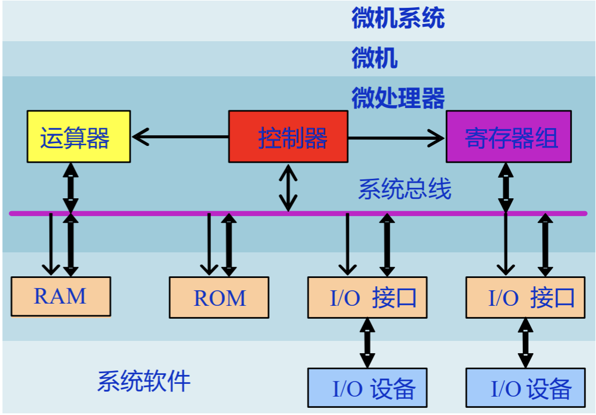
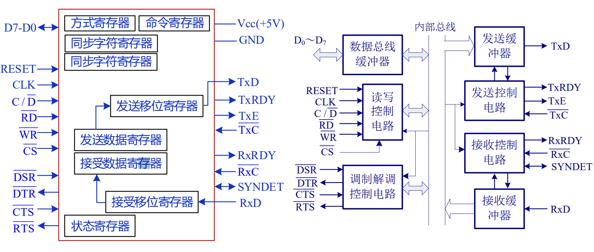

# Ch01 绪论

## 计算机系统组成

- ### 两种计算机结构

  - 冯诺依曼结构（普林斯顿结构）： 

  ​                                     	

  - 哈佛结构： 双存储器（程序存储器+数据存储器）：吞吐量up，但结构复杂

    

  - 主要区别：数据空间与程序空间是否分开，eg：冯PC机，哈佛Arm架构

- 

- ### 微型计算机系统

  - 硬件
    - 主机	
      - CPU（微处理器） 
        -  运算器（ALU） 
        -  控制器（最重要）
        -  寄存器组(基本单元：触发器组)
      - 存储器： RAM && ROM
      - I/O接口
      - 系统总线
    - 外设
  - 软件
    - 系统软件
    - 应用软件

- 摩尔定律：芯片的容量(可容纳的元器件的数目)每18-24个月会增加一倍

- 嵌入式系统：

  - 专用性->针对特定场景与用途
  - 软件硬件可裁剪
  - 成本低(Soc技术)
  - 体积小、功耗低、可靠性高（Watchdog：硬件/软件，清狗喂狗）
  - 实时性


## 硬件组成

- ### CPU

  - 运算器： 
    - 算术逻辑单元：ALU（Arithmetic Logical Unit）
    - 两输入 + 一控制信号（算术/逻辑） ->运算结果
  - 控制器
    - 指令：经编码的二进制数（机器码），被控制器译码->执行
    - 程序：指令序列
    - 普通CPU无级流水：取指，译码，运算执行，访存，写回
    - 指令系统计算机：复杂(CISC),简单（RISC）
      - CISC 复杂指令系统计算机：指令复杂 硬件复杂 编译简单 Intelx86
      - RISC 精简(Reduced)   : 指令简单 硬件简单 编译复杂 ARM,MIPS

- ### 存储器

  - 分类
    - 高速缓存：Cache（cpu内）
    - 主存储器(内存):RAM+ROM
    - 辅助存储器(外存)：u盘，磁盘
  - 存储单位： 
    - 位bit ： 最小， 二进制数位，记作b
    - 字节byte：1byte=8bit，基本存储单位，记作B
      - 1KB=1024B....MB,GB,TB
    - 字word： 取决于cpu数据总线位数，字长反应计算机并行处理能力
      - eg，16位cpu：word长16bit，32位....
      - care: 字长 = cpu数据位数 = cpu数据总线位数
  - 存储器组织
    - 地址总线位数 > 存储器的地址范围(字数)
      - cpu地址范围超过存储器地址范围->字扩展->一次读很多，并联提高效率
    - 数据总线位数 > 存储器的数据范围(位数）
      - cpu数据位数超过存储器数据位数->位扩展->容量不够，串联翻倍

- ### 系统总线

  

  - Address Bus(AB):  单向，cpu向存储器/io端口传送地址，决定可直接寻址的内存容量 $2^n$
  - Data Bus(DB)：    双向、三态，进行数据交换，位数=cpu位数
  - Control Bus(CB):  准双向，传输控制信号
  - 分类
    - 数据传输方向上：
      - 单工（喇叭）
      - 双工： 半双工(对话机)，全双工(手机)
    - 定时特征(clocking)：同步、异步（数据传输速率可变）
  - 总线结构
    - 单总线结构->cpu与内存无存储总线->数据传输效率不行
    - 面向CPU的双总线结构->存储主线+IO主线，内存只与cpu相连->数据传输速率ok，cpu工作效率降低
    - 面向主存的双总线结构->内存与IO总线和cpu相连->数据传输速率+cpu工作效率都ok

- ### I/O设备：

  - 寻址方式

    - 统一编址法：外设存储器与内存一看待
    - 单独编址法：访问外存储器和内存采用不同指令

  - 四种数据传送方式

    - 程序直接控制方式: 早期，cpu控制，内存->cpu->外设，忙-等待模式
    - 中断驱动方式：允许I/O设备打断cpu运行，同样经过cpu，低效
    - DMA方式(直接存储器访问方式)：内存->DMA controller->外设
    - 通道方式：多外设，通道而非cpu控制传输的数据块大小、传输的内存位置

  - 中断

    - 简单的中断

    ```cpp
    中断处理过程：
        关中断->识别现场->识别中断->形成服务程序入口地址->执行服务程序->恢复现场->开中断
        （关中断后不允许其它中断打断）
    ```

    - 多重中断
      - 中断程序也可以被打断，按照优先级


## 软件组成

- 分类
  - 系统软件
    - 操作系统，windows，linux
    - 编译程序：高级语言，如c
    - 解释程序：可立即执行，如basic

  - 应用软件
    - 专门开发，如matlab，wps

- 大部分功能：软件/硬件都可实现，硬件快，但成本高、不易改变、灵活性差
- 固件：固定不变的常用软件写入只读存储器(ROM),如PC中ROM-BIOS的启动软件
- 操作系统
  - 交互操作系统： 常用于PC、服务器，如dos，windows等
  - 实时操作系统： 常用于嵌入式系统，如Vxworks，Rt-Linux等，响应的及时性，可根据需求裁剪

- 计算机语言
  - 机器语言：二进制码
  - 汇编语言：助记符，实质不变
  - 高级语言：与计算机种类无关，C，basic等
  - 应用语言：应用程序中使用的语言，SQL,html等

- 计算机语言编译过程
  - 源文件(.c)->预编译(.i)->编译(.s汇编程序)->汇编(.o目标文件)->链接(可执行文件)


## 数据编码

- 数制

  - 二进制B, 八进制Q/O, 十进制D，十六进制H

- 机器数：

  - 无符号数

  - 有符号数

    - 原码: 符号位+数

    - 反码: $-(2^n-1) 到 2^{n}-1$

      - 正数，反码即原码
      - 负数，符号位不变，之后取反

    - 补码: $-2^n 到 2^{n}-1$

      - 正数，即原码

      - 负数，反码+1

      - 补码可直接加减

        ```cpp
        eg1   x=0.1010, y=-0.0011，补码：[x]=0.1010, [y]=1.1101
              [x]+[y]=0.1010+1.1101=0.0111, x+y=0.0111
        ```

    - 移码

- 浮点数

  - 组成：阶码E，尾数M，符号位S    |S|E|M|
  - $N = (-1)^S * M * R^E$
  - 表示范围：上溢/下溢->阶码R
  - 阶码E的位数->表示范围，尾数M的位数->精度
  - 规范化浮点数编码(IEEE754):
    - $N = (-1)^S * 1.M * 2^E$, S、M采用原码
    - 单精度：E=e+127， 双精度：E=e+1023
    - 单精度： s占1位，E占8位，M占23位
      - $224=11100000=1.11*2^7 =1.11*2^{134-127}$, S=0,E=134=10000110,M=1100....

    - 双精度： s占1位，E占11位，M占52位
      - $224=11100000=1.11*2^7 =1.11*2^{1030-1023}$, S=0,E=1030=10000000110,M=1100....

- ASCII码（American Satandard Code for Information Interchange）:

  - ```cpp
    0: 30h   1: 31h  ...  9: 39h
    A: 40h           ...  a: 60h     
    ```


- 数据存储：

  - 字节存储顺序

    - 大数端(big Endian)：最低字节存储在高地址

    - 小数端(little ~):  低字节存储在低地址

  - 数据存储方式

    - 对齐 && 非对齐

- 逻辑运算

  - 与或非
  - 移位
    - 逻辑移位：移出位到进位C，空位补0
    - 算术移位：
    - 循环移位
  - 


# Ch02 8086微机系统 

## 结构与功能

- 数据总线AB： 16位，

- 地址总线DB： 20位，可寻址$2^{20}$=1MB的内部空间

- 结构特点

  - 指令流水线：两级流水->取指令， 译码执行指令并行
  - 20位地址总线，数据总线16位->分段

- 编程结构：执行单元+总线接口单元

  - 

- 寄存器结构

  - 

  - 通用寄存器： AX BX CX DX

    - ```txt
      AX:  加法乘法中操作数，函数返回值等
      BX   存放基地址，DS:BX
      CX   loop循环计数器
      DX   辅助AX(构成双字)，进行乘除法；寄存器间接寻址存放IO端口地址
      SI、DI 变址寻址
      BP    存放基地址，SS:BP
      SP    栈顶指针
      CS、IP  搭配段地址与偏移地址
      DS    数据段段地址
      ES    扩展段段地址,字符串操作时作为目标地址
      SS    栈段
      FLAG  标志寄存器
      ```

    - 指令操作数不能是IP，用户不能直接访问

    - 标志寄存器Flag 

      - 
      - 16位，用9个： OF DF IF TF SF ZF AF PF CF
      - ZF  Zero Flag 零标志位，记录执行操作后其结果是否为0， 是ZF=1
      - PF  Parity Flag 奇偶校验标志位，低八位二进制所有bit位中1的个数是否为偶数，偶数个1则PF=1
        - 嵌入式通信检测常用
      - SF  Symbol Flag 符号标志位，记录执行相关指令后结果是否为负数，负数则SF=1
        - 不管有符号数还是无符号数，只是一种记录，取决于运算后第一位
      - CF  Carry Flag 进位标志位，假想最高位， 减法借位也算
      - AF  Auxiliary Carry Flag 辅助进位标志位，低4位向高4位借位或进位，AF=1
      - OF  Overflow Flag 溢出标志位
        - CF与OF，认为运算是无符号数CF，有符号数看OF
      - DF  definition flag，方向标志位，控制每次si与di的增减
        - DF=0，地址增址；DF=1，地址减址
        - cld指令： DF标志位清0
        - std指令： DF标志位置1
      - IF  中断允许标志位：IF=1允许cpu响应外部可屏蔽中断
      - TF  跟踪标志，TF=1 单步调试工作状态
      - MOV指令一般不改变标志位

## 引脚与总线结构

- 两种工作模式

  - 最小模式：$MN/\bar{MX}$ =1，单微处理器，控制信号全由cpu提供
  - 最大模式：$MN/\bar{MX}$ =0，多微处理器

- 引脚            

- 地址锁存器 74LS373：三态     

- 数据缓冲器 74LS245：双向三态

- 存储器 分体结构：字节操作，分奇偶地址；都为0，字操作

  

  - 奇地址->系统数据总线高八位$D_{15}-D_8$ ->$\overline{BHE}=0$
  - 偶地址->          低八位$D_7-D_0$  ->$A_0=0$

## 存储器组织

- 物理存储系统
- 分段管理
- 物理地址=段地址<<4+偏移地址
  - 
  - 物理地址对应的偏移地址不唯一
- 数据存取
  - 数据对齐：字单元从偶地址开始，只需访问一次存储器；奇地址两次
- 堆栈 STACK：先进后出(FILO)
  - SS:SP, 出栈入栈：SP加减2

## CPU时序

- 时钟频率：5MHz，一个时钟周期 200ns
- 总线周期：通过总线对存储器/IO接口访问所需的时间
- 一个指令->多个总线周期，一个总线周期->至少四个时钟周期

## CPU寻址方式

- 立即数操作数       	MOV AX,1234H
  - 对段操作数不能用立即数赋值，如
  - 立即数不能作目的操作数
  - 给存储器操作数赋值时，指明 Word PTR或Byte PTR  如MOV BYTE PTR [200H],5FH
- 寄存器操作数  MOV AX,1234H; MOV SS,AX
  - 两个操作数长度需一致
  - 操作数为通用寄存器或段寄存器
- 存储器操作数
  - 直接寻址
    - MOV AX,[3000H]; MOV AX,ES:[2000H]; MOV AX,VAL;(VAL为变量)
  - 寄存器间接寻址  
    - 操作数只能是四种，基址寄存器：[BX] [BP] 变址寄存器：[SI] [DI]
    - 如MOV BX,[SI]
  - 寄存器相对寻址  
    - MOV AX,[SI+1003H]
  - 基址变址寻址   
    - MOV AX,[BX+DI] = [BX] [DI]
  - 相对基址变址寻址 
    - MOV AX,[BX+DI+06H]

- 转移指令
  - 段内转移与段间转移	
    - 前者只修改IP，如jmp ax
    - 后者同时修改CS:IP, 如 jmp 1000:0
    - 近转移：SHORT 或 NEAR PTR， 远转移：FAR PTR
  - 分类
    - 无条件跳转
    - 条件跳转
    - 循环指令
    - 过程
    - 中断

## 指令


### 数据传送指令

- MOV指令
  - 不能将立即数直接送入段寄存器，中转一下
  - 不影响标志位
- PUSH、POP
  - 可用于保护与恢复寄存器内容，如中断
- XCHG
  - XCHG AX,[BX+DI] 不通过中介直接交换
  - 不能都是存储器，不能有段寄存器
- XLAT
  - 查表转换，将一个字节从一种代码转换成另外一种
- IN、OUT 读取端口
  - IN AX/AL，端口地址(8位地址或先用DX存储的地址)
  - OUT 端口地址，AX/AL
  - 寄存器只能用AX AL DX
- LEA取有效地址
  - LEA 目的，源  取源操作数的偏移地址
  - eg LEA BX,TABLE 等价于 MOV BX,OFFSET TABLE
- LDS将双字指针送到 寄存器（前两个字节）和DS（后两个字节）
  - LDS SI,[450H],其中DS=1200H,(12450H)=F346H,(12452H)=0A90H
  - 送入SI的是(12450)=F346H.送入DS的是(12452H)=0A90H
- LES将双字指针送到 寄存器和ES中，与LDS相似
- LAHF 将Flag标志寄存器的低八位(包含SF ZF AF PF CF)送到AH寄存器
  - SAHF 将AH中的值送入Flag寄存器中
- PUSHF 标志入栈指令，把Flag寄存器内容入栈
- POPF  出栈到Flag

### 算术运算指令 

- ADD AX,[30H] 加法
  - ADC AX,[30H] 额外加进位标志位CF
- SUB AX,BX 减法：AX=AX-BX
  - SBB 额外减CF
- INC 自增   INC BL
- DEC 自减   DEC CL
- CMP 目的，源
  - 相当于执行SUB，当仅影响标志位，不影响操作数
- NEG 取反
- MUL 乘法 MUL SRC
  - SRC是一个字节，(AX)=(AL)*SRC
  - SRC是一个字，(DX,AX)=(AX)*SRC
  - 带符号数用IMUL
- DIV 除法 DIV SRC
  - 有符号除法IDIV
- CBW Convert Byte to Word
  - 用AL中的符号位$D_7$填满AX
- CWD Convert Word to Double Word

### 逻辑运算

- NOT 按位取反
- AND 逻辑与     某位清0  AND AL,1111 1101B
- OR  逻辑或     某位取1  OR AL,0000 0010B
- XOR 逻辑异或   某位取反 XOR  AL,0000 0010B
- TEST 进行逻辑与运算，如TEST AL,80H  判断AL的$D_7$是否等于0
- 算术移位
  - SAL算术左移 Shift Arithmetic Left
  - SAR算术右移
  - SHL逻辑左移
  - SHR逻辑右移
- 循环移位
  - ROL循环左移   	Rotate left
  - ROR循环右移
  - RCL通过进位位循环左移 Rotate through carry left
  - RCR通过进位位循环右移

### 串操作

- 源串位于数据段时用DS:SI，位于附加段时用ES:DI

- MOVS 字符串传送指令

  - MOV不能在存储单元之间进行数据传送，从SI复制到DI

    ```cpp
    //将数据段的str1传入str2,100字节
    MOV AX,DS   
    MOV ES,AX     //数据段DS传入附加段ES，因为
    LEA SI,str1    //si指向源
    LEA DI,str2    //di指向目的
    MOV CX,100    //计数
    CLD           //清0
    REP MOVSB
    ```

- CMPS 字符串比较指令

- SCAS 字符串扫描指令

- LODS 数据串装入指令

### 控制转移操作

- 无条件 JMP

- 条件跳转

  - JZ/JE ZF=1结果为0

  - JNZ/JNE ZF=0

  - JS SF=1

  - JNS SF=0

  - JO OF=1

  - JNO OF=0

  - JP/JPE PF=1

  - JNP/JPO PF=0

  - ```CPP
    //比较成绩打印不同的字符                 //比较两个双字有符号数(DX,AX)和(BX,CX)大小，大于跳到标记X，小于跳到Y
            CMP AL,60                     CMP DX,BX
            JB FAIL                       JG X
            CMP AL,85                     JL Y
            JAE GOOD                      CMP AX,CX
            MOV AL,'P'                    JA X
            JMP PRINT                 Y:  ...
    FAIL:   MOV AL,'F'                    JMP NEXT
            JMP PRINT                 X:  ...
    GOOD    MOV AL,'G'             EXIT:  ...
    PRINT   ...
    ```

- 循环指令

  - LOOP + 执行目标，默认减CX直到0

    - LOOPE/LOOPZ 相等或结果为0时循环

    - LOOPNE/LOOPNZ 不相等或结果不为0循环

    - ```cpp
      ## 循环求数之和
      assume cs:codesg
      codesg segment
          dw 0123H,0456H,0789H
      start:
      	mov bx, 0
      	mov ax, 0
      	
      	mov cx, 3   ## 循环三次
      s:  add ax, cx:[bx]
          add bx, 2
          loop s
          
          mov ax, 4c00H
          int 21H
      codesg ends
      
      end start
      ```

  - CALL   

  - ```cpp
    eg1: 相当于 push IP + jmp near ptr 符号 
         如下图： call s相当于 将当前IP(下一条指令对应的偏移地址)：6放入栈中，然后跳转到s: pop ax,
                 故完整执行完后输出 AX = 6
    补： CALL AX 相当于跳转到偏移地址AX的地方
    ```

  - RET与call指令相反

### 处理器控制指令

- CLC 令CF=0   STC 令cf=1   CMC 令CF取反
- CLD 令DF=0   STD 令DF=1
- CLI 令IF=0   STI 令IF=1 

### 中断

- 中断源
  - 外部中断（硬件中断） 从8086的NMI与INTR引脚引入
    - 不可屏蔽中断 引脚NMI，中断类型码2
    - 可屏蔽中断   引脚INTR  用中断类型码IF来屏蔽(STI指令开中断，CLI指令关中断)，一般是外部设备的请求

  - 内部中断（软件中断） 意外或INT指令


  - 中断类型码(一个字节->可表示256种中断信息)

    - 除法错误，如溢出->0    单步执行->1   不可屏蔽中断->2  断点中断->3   溢出中断->4     int指令->int n，中断码n
    - 中断向量表：存储中断处理程序入口的列表，存储着256个中断源对应的入口

      - 对8086,内存前1KB空间，即0000:0000到0000:03FF的1024单元存放中断向量表，一个表两个字节，高字节段地址，低字节偏移地址


  - 中断过程：中断类型码->中断向量表->修改CS:IP->中断处理程序

  - ```cpp
    取得中断处理码N-> pushf -> TF=0,IF=0 -> push CS -> push IP -> (IP)=(n*4),(CS)=(n *4+2)->中断处理程序
        保存寄存器（栈）-> 处理中断 -> 恢复寄存器 -> 用iret指令返回
    ```
    
  - 

- 中断时，入栈保存的环境有：PSW(标志寄存器或FR), DS IP

- IRET 中断服务程序的出口处，恢复保存值

- INTO 溢出检测，在加法运算后写INTO，判断是否溢出

- BIOS/DOS   rom中存放一套程序，称为BIOS，用于处理硬件检查、初始化，系统中断等相关

  ​		   dos也会提供一些中断例程 

# Ch03 汇编程序设计

- 标记: 助记符 操作数，操作数； 注释

  - 注释用；隔开

- MASM表达式：

  

- 逻辑：真0FFFFH，假0

- 数值返回符： SEG返回段基址 OFFSET返回偏移地址 

- 修改属性符:  PTR，THIS

- 优先级

  

- DB  字节   DW 字   DD 双字   DQ 四字  DT 十字

  # Ch04 存储器

- 分类

  - RAM 随机访问存储器
    - SRAM 静态存储器 Static Random Access Memory
    - DRAM 动态存储器 Dynamic
  - ROM 只读存储器  Read Only Memory
    - EPROM:可擦除可编程只读存储器
    - EEPROM/E2PROM：电可擦除可编程只读存储器

- SRAM：六MOS管，不断电信息不丢失，电路复杂成本高，多做cache

- DRAM: 单MOS管，要不断电容充电，否则信息丢失

  - $\overline{RAS}$ 行地址选通，$\overline{CAS}$ 列地址选通
  - 分时复用，分两次传入，先行后列,$\overline{RAS}$低，$\overline{CAS}$后变低写入列

  ## 存储器扩展

- 片选信号形成

  - 线选法：直接用某位高位地址，浪费地址，地址重叠问题
  - 全译码：全部高位地址参加译码，地址唯一，但电路复杂
  - 部分译码：部分高位地址参加译码，地址重叠但小系统可用

- 译码： 74LS138 3-8译码器

  - 字扩展： 增加地址范围，串联 16K * 8-> 64k * 8,译码器决定片选信号

- 位扩展：并联->64K * 1-> 64K * 8

## 典型接口芯片

### 简单接口电路

- I/O与系统总线连接：速度、信号电平、信号格式、时序不匹配->接口电路

- 接口功能：数据缓存器、电平转换电路、信息转换逻辑、时序控制电路，与问题一一对应；提供地址译码电路，使cpu一个时刻只能选中一个端口

- 74LS244 和 245 :缓冲器+提高总线驱动能力
  - 三态输出： 使能端使能，正常输出；否则，处于高阻态，相当于断开
  - 74LS244 单向数据缓存器，门控信号 $\overline{1G}$ 和 $\overline{2G}$ 
  - 74LS245 双向数据缓存器，门控信号$\overline{G}$ 和方向控制端$DIR$，前者使能后者控制方向

- 74LS373 锁存器，允许输出端 $\overline{OE}$ 与 输入使能端G，前者为高时高阻态，后者为低时锁存

- 寻址方法： 存储器映像寻址方式和I/O单独编址方式

- 数据传送方式：

  - 软件控制无条件传送

  - 软件控制条件传送: cpu先确定外设已处于准备数据传送状态

    - 查询式输入、输出方式

    - ```cpp
      		 MOV BX,0        //初始化地址指针
        		 MOV CX,COUNT_1  //count_1存储的字节数给cx
      READ_S1: IN AL,PORT_S1   //读入状态口地址
               TEST AL,01H     //检测数据是否准备好
               JZ READ_S1      //否： 循环
               IN AL,PORT_IN   //准备好，读取
               MOV [BX],AL     //存到要存放的地址中
               INC BX          //地址指针自增
               LOOP READ_S1    //传送cx次
      ```

    - ```cpp
      //输出
               MOV CX,COUNT_2  //传送字节数
      READ_S2: IN  AL,PORT_S2  //读入状态口
               TEST AL,02H     //是否忙
               JNZ READ_S2     //忙，循环
               MOV, AL         //不忙输出
               OUT PORT_OUT, AL//存到内存缓冲区
               LOOP READ_S2    //未传送完循环
      ```

  - 中断方式

  - 硬件DMA方式

### 8255A

- 可编程并行外围接口芯片
- 并行接口
- 三种方式：
  - 方式0： 基本输入输出方式 A B C口
    - 输入：AC高4位，输出：BC低4位
    - 方式0下，C口有按位进行置位与复位的能力
    - 输出口锁存，输入口无锁存
    - 应用：无条件传送方式，查询工作方式(AB口传送数据，C口应答：高4位输入低4位输出)
  - 方式1： 选通的输入输出方式 A B C口
    - A组：A口高4位设为输入/出口，C口高4位用作A口输入/出的控制同步信号
    - B组：B口低4位设为输入/出口，C口低4位用作B口输入/出的控制与同步信号
    - A、B口的输入输出数据都被锁存
  - 方式2： 双向传输方式 只能A口
- 方式控制字
  - A组： 

### 8253定时器

- 可编程定时/计数器8253->减法计数器，16位可编程定时/计数器芯片
- 

-  引脚： $\overline{CS}$:片选，1不能进行任何操作； $\overline{RD}$：写入，$\overline{WR}$：读取；
- 三个相同的计数器，引脚CLK, GATE, OUT;每个计数器包括一个初值寄存器、计数执行单元、输出锁存器。
- 启动方式：
  - 软件启动：实际Clk脉冲个数比编程写入的计数初值N要多一个(即N+1，因为第一个脉冲并没有计数)
  - 硬件启动：写入初值->门控信号Gate由低变高->CLK上升沿采样->CLK下降沿开始计数，也实际clk脉冲取决于之前这个流程用时
- 计数方式
  - 不重复计数：减到0即停止
  - 自动重复计数：只要Gate高，OUT一直重复的输出周期脉冲（这种模式稳定后，启动造成的误差自然不存在）
- 工作方式：6种工作方式，其中方式0：计数结束中断方式，方式1：可重复触发的单稳态触发器，方式2：频率发生器，方式3：方波发生器

​	

- 控制字

​	 

- 8253初始化：

  - 写入方式控制字->写入计数初值->读取计数初值

  - ```cpp
    题目：三个计数器端口地址 3F0H 3F1H 3F2H,控制字寄存器端口地址为 3F3H，要求通道0工作于方式3，且计数初值n=1234，则初始化程序：
        MOV AL, 00110111B  //通道0 00 //先低后高 11 //方式3 011 //BCD码计数 1
        MOV DX, 3F3H       //控制字寄存器端口地址
        OUT DX, AL         //将控制字送入控制口
        MOV DX, 3F0H       //通道0口的地址
        //写计数初值
        MOV AL, 34H        //计数值低字节
        OUT DX, AL         //写
        MOV AL, 12H        //计数器高字节
        OUT DX, AL         //写
    后续：读当前计数值的程序
        IN AL,  DX         //读低字节
        MOV AH, AL         //存到AH
        IN AL,  DX         //读高字节
        XCHG AH,AL         //存入AX，高低对应
        MOV CX,1234+1      //求计数值
        SUB CX, AX         //得到计数值，cx=cx-ax
    ```

  ### 8251A

- 可编程USART通信接口芯片，同步/异步功能，全双工，出错检测电路

- 引脚

- 方式字

- 数据交换方式

  - 查询方式：数据交换前查询状态寄存器，D0=1时cpu可以向数据端口写入，串行数据发送；D1=1时cpu可以从数据端口读，完成数据接受
  - 中断方式：RxRDY引脚 或 TxRDY引脚 或 二者皆

- 串行接口协议 RS-232C

